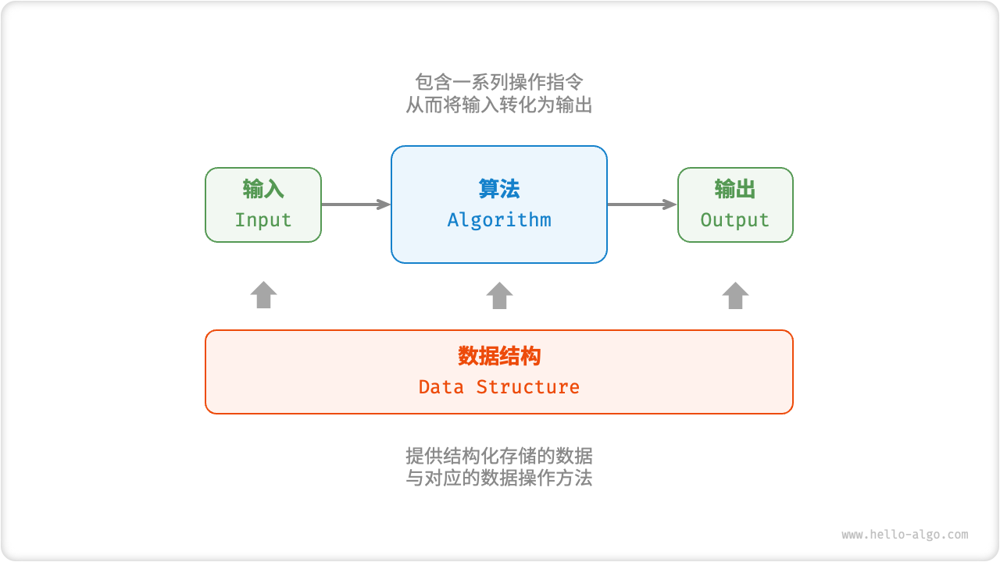

# 算法与数据结构

## 算法是什么？

- 定义: 在特定计算机模型上, 解决特定问题的指令序列;
- 输入与输出: 有确定的输入与输出;
- 正确性: 能够解决特定问题;
- 确定性: 由明确的指令序列描述;
- 可行性: 每条指令可在常数时间内完成;
- 有穷性: 任何输入经过有穷次操作后都能得到输出;

## 数据结构是什么？

- 定义: 计算机中组织和存储数据的方式;
- 关注点: 数据之间的逻辑关系、在内存中的存放方式、以及定义在其上的操作;

## 算法与数据结构是什么关系？

- 数据结构为算法提供操作对象与操作接口;
- 算法用数据结构上的操作完成问题求解;
- 两者共同决定程序的运行效率, 换数据结构往往意味着换算法;

