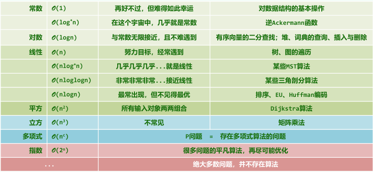
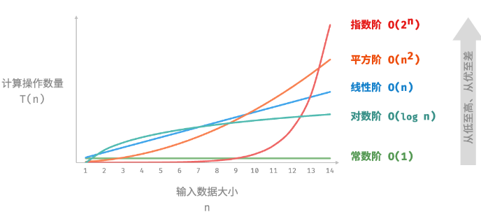

# 时间复杂度

## 时间复杂度的三种口径分别是什么？

- 最差时间复杂度: 规模为 n 时运行时间的上界, 最常用;
- 最佳时间复杂度: 最快输入下的运行时间;
- 平均时间复杂度: 全部输入下运行时间的期望;

## O、Ω、Θ 分别表示什么？

- 存在正常数 c, 当 n 充分大时 `T(n) < c · f(n)`, 记 `T(n) = O(f(n))`;
- 存在正常数 c, 当 n 充分大时 `T(n) > c · f(n)`, 记 `T(n) = Ω(f(n))`;
- 存在正常数 `c1 > c2 > 0`, 当 n 充分大时 `c2 · f(n) < T(n) < c1 · f(n)`, 记 `T(n) = Θ(f(n))`;

$$T(n) = O(f(n)) \quad \Longleftrightarrow \quad \exists c > 0,\ T(n) < c \cdot f(n),\ \forall n \gg 2$$

## 如何从代码估算时间复杂度？

| 代码结构      | 估算规则                 |
| ------------- | ------------------------ |
| 顺序语句      | 各段运行时间求和         |
| 单层 for 循环 | 单次运行时间 × 迭代次数  |
| 嵌套 for 循环 | 各层迭代次数的乘积       |
| 条件语句      | 取各分支中运行时间最大者 |

## 常见的时间复杂度有哪些？

| 阶         | 名称       | 典型来源                     |
| ---------- | ---------- | ---------------------------- |
| O(1)       | 常数阶     | 与输入规模无关的固定次数操作 |
| O(log n)   | 对数阶     | 二分查找、循环变量折半       |
| O(n)       | 线性阶     | 单层循环                     |
| O(n log n) | 线性对数阶 | 每层折半划分 + 每层线性合并  |
| O(n^2)     | 平方阶     | 双重嵌套循环                 |
| O(2^n)     | 指数阶     | 每层规模的翻倍枚举           |
| O(n!)      | 阶乘阶     | 全排列递归                   |




## 各阶复杂度的代码形态是什么？

```typescript
// O(1): 循环次数与输入规模无关
function constant(n: number) {
  let count = 0;
  for (let i = 0; i < 100000; i++) count++;
  return count;
}

// O(log n): 每轮把问题规模折半
function logarithmic(n: number) {
  let count = 0;
  while (n > 1) {
    n = n / 2;
    count++;
  }
  return count;
}

// O(n): 单层循环
function linear(n: number) {
  let count = 0;
  for (let i = 0; i < n; i++) count++;
  return count;
}

// O(n log n): 每层划分为两半, 每层做线性合并
function linearLogRecur(n: number): number {
  if (n <= 1) return 1;
  let count = linearLogRecur(n / 2) + linearLogRecur(n / 2);
  for (let i = 0; i < n; i++) count++;
  return count;
}

// O(n^2): 双重嵌套循环
function quadratic(n: number) {
  let count = 0;
  for (let i = 0; i < n; i++) {
    for (let j = 0; j < n; j++) count++;
  }
  return count;
}

// O(2^n): 第 i 层执行 2^i 次
function exponential(n: number) {
  let count = 0;
  let base = 1;
  for (let i = 0; i < n; i++) {
    for (let j = 0; j < base; j++) count++;
    base *= 2;
  }
  return count;
}

// O(n!): 每层递归枚举剩余元素
function factorialRecur(n: number): number {
  if (n === 0) return 1;
  let count = 0;
  for (let i = 0; i < n; i++) count += factorialRecur(n - 1);
  return count;
}
```
