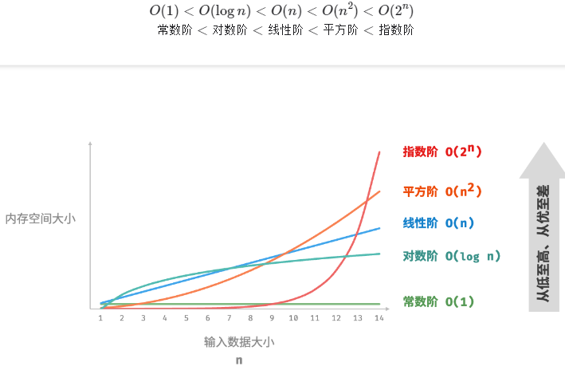

# 空间复杂度

## 空间复杂度统计哪些内存？

- 输入空间: 存储输入数据占用;
- 暂存空间: 运行过程中临时变量、对象与调用栈占用;
- 输出空间: 存储输出数据占用;

## 如何估算空间复杂度？

- 以最差输入数据为准;
- 以运行过程中的峰值内存为准, 而不是把各阶段占用累加;

## 常见的空间复杂度有哪些？

| 阶       | 典型结构                       |
| -------- | ------------------------------ |
| O(1)     | 固定个数的变量、常量与对象     |
| O(log n) | 分治或数据类型转换的递归调用栈 |
| O(n)     | 数组、列表、哈希表等线性结构   |
| O(n^2)   | 矩阵、二维列表、邻接矩阵       |
| O(2^n)   | 递归构造的二叉树等指数增长结构 |



## 各阶复杂度的代码形态是什么？

```typescript
// O(1): 常量、变量、定长数组; 循环内局部变量每轮复用同一空间
function constant(n: number) {
  const a = 0;
  const nums = new Array(10000);
  const node = new ListNode(0);
  for (let i = 0; i < n; i++) {
    const c = 0;
  }
}

// O(n): 长度随输入规模增长的线性结构
function linear(n: number) {
  const nums = new Array(n);
  const nodes: ListNode[] = [];
  for (let i = 0; i < n; i++) nodes.push(new ListNode(i));
  const map = new Map<number, string>();
  for (let i = 0; i < n; i++) map.set(i, String(i));
}

// O(n^2): 矩阵与二维列表
function quadratic(n: number) {
  const numMatrix = Array.from({ length: n }, () => new Array(n).fill(0));
  const numList: number[][] = [];
  for (let i = 0; i < n; i++) {
    const row: number[] = [];
    for (let j = 0; j < n; j++) row.push(0);
    numList.push(row);
  }
}

// O(2^n): 递归构造满二叉树
function buildTree(n: number): TreeNode | null {
  if (n === 0) return null;
  const root = new TreeNode(0);
  root.left = buildTree(n - 1);
  root.right = buildTree(n - 1);
  return root;
}
```
