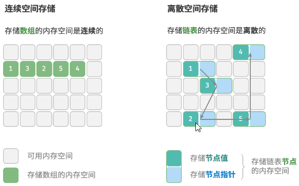

# 逻辑结构与物理结构

## 逻辑结构分为哪几类？

- 线性结构: 元素之间存在一对一的次序关系;
  - 数组、链表、栈、队列、哈希表;
- 非线性结构: 元素之间不是简单的一对一关系;
  - 树形结构: 树、堆、哈希表;
  - 网状结构: 图;
- 哈希表在两类分类中都出现: 对外按键访问, 内部实现同时依赖线性表与树/链表;

## 物理结构分为哪几类？

- 连续空间存储: 元素地址连续, 如数组; 可按地址公式直接定位;
- 离散空间存储: 元素分散存放, 用引用串接, 如链表; 需要额外空间保存指针;

## 逻辑结构与物理结构是什么关系？

- 逻辑结构描述元素之间的关系, 与内存布局无关;
- 物理结构描述逻辑结构在内存中的实现方式;
- 同一逻辑结构可以有多种物理实现, 例如栈、队列既可基于数组, 也可基于链表;
