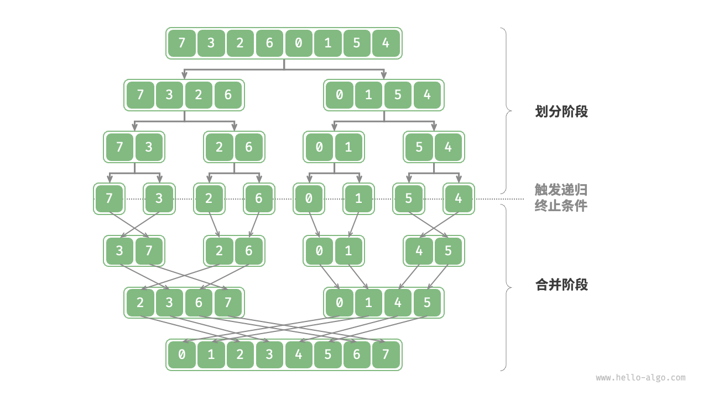

# 归并排序

## 归并排序如何工作？

- 划分阶段: 通过递归从数组中点一分为二;
- 递归顺序: 先左子数组, 再右子数组, 最后合并;
- 终止条件: 子数组长度为 1;
- 合并阶段: 把两个较短的有序数组合并为一个较长的有序数组;



## 如何合并两个有序子数组？

- 左子数组区间为 [left, mid], 右子数组区间为 [mid+1, right];
- 双指针 i, j 分别指向两段首元素, 每次取较小者写入临时数组;
- 某一段取完后, 把另一段剩余元素依次接上;
- 把临时数组写回 nums 的对应区间;

## 归并排序如何实现？

```typescript
function mergeSort(nums: number[], left: number, right: number): void {
  if (left >= right) return;
  const mid = Math.floor((left + right) / 2);
  mergeSort(nums, left, mid);
  mergeSort(nums, mid + 1, right);
  merge(nums, left, mid, right);
}

function merge(nums: number[], left: number, mid: number, right: number): void {
  const tmp = new Array(right - left + 1);
  let i = left;
  let j = mid + 1;
  let k = 0;
  while (i <= mid && j <= right) {
    tmp[k++] = nums[i] <= nums[j] ? nums[i++] : nums[j++];
  }
  while (i <= mid) tmp[k++] = nums[i++];
  while (j <= right) tmp[k++] = nums[j++];
  for (k = 0; k < tmp.length; k++) nums[left + k] = tmp[k];
}
```

## 归并排序的特性是什么？

- 时间复杂度: O(n log n), 与输入是否有序无关;
- 空间复杂度: O(n), 合并需要临时数组;
- 稳定性: 稳定排序, `nums[i] <= nums[j]` 时优先取左段;
- 典型应用: 统计逆序对, 见 [逆序对](../020-排序应用/070-逆序对.md);
