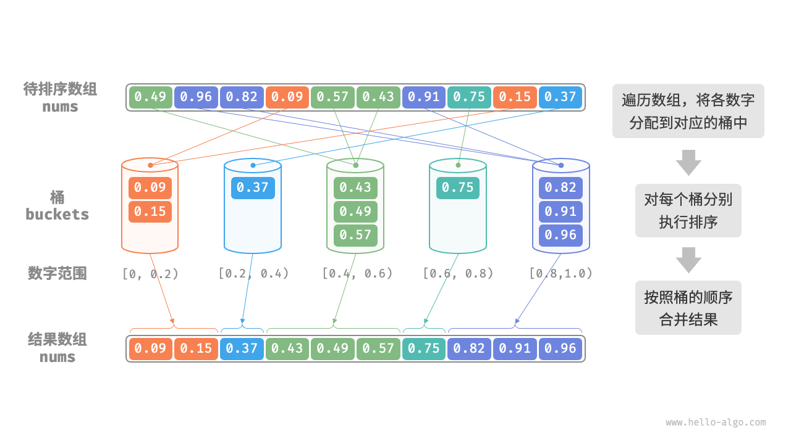

# 桶排序

## 桶排序如何工作？

- 初始化 k 个桶, 把 n 个元素按值域均匀分配到桶中;
- 对每个桶分别排序;
- 按桶的顺序合并所有元素;



## 元素如何映射到桶？

- 桶数: `k = floor(n / size)`;
- 映射: `index = floor((num - min) / (max - min) * (k - 1))`;
- 边界: 所有元素相等时值域为 0, 直接返回;

## 桶排序如何实现？

```typescript
function bucketSort(nums: number[], size: number): void {
  const k = Math.floor(nums.length / size);
  const buckets: number[][] = Array.from({ length: k }, () => []);
  const min = Math.min(...nums);
  const range = Math.max(...nums) - min;
  if (range === 0) return;
  for (const num of nums) {
    const i = Math.floor(((num - min) / range) * (k - 1));
    buckets[i].push(num);
  }
  for (const bucket of buckets) {
    bucket.sort((a, b) => a - b);
  }
  let i = 0;
  for (const bucket of buckets) {
    for (const num of bucket) nums[i++] = num;
  }
}
```

## 桶排序的特性是什么？

- 时间复杂度: O(n + k), 分配需要 n, 合并需要 k; 桶内排序的代价另计;
- 空间复杂度: O(n + k), k 个桶加 n 个元素;
- 适用场景: 取值集中在有限范围内的数字, 或可哈希为数字的数据; 数据量大时尤为合适;
