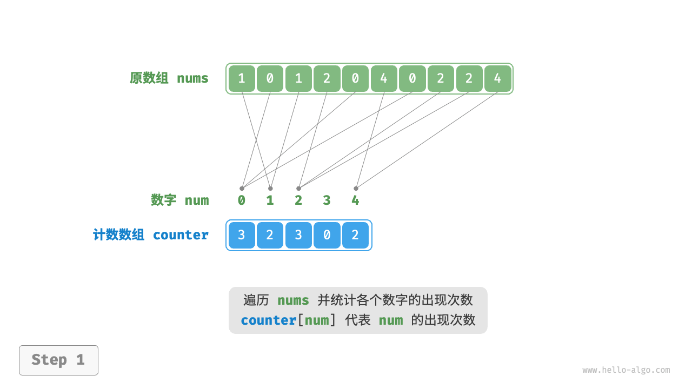
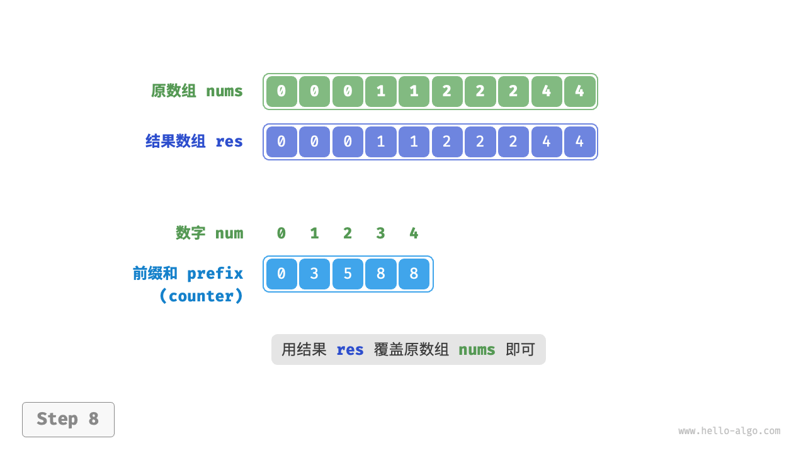

# 计数排序

## 计数排序如何工作？

- 统计: counter[num] 记录 num 在数组中出现的次数;
- 前缀和: 对 counter 求前缀和, 把"出现个数"转换成"数组索引";
- 回填: 倒序遍历原数组, 按 `prefix[num] - 1` 把元素写入结果数组的对应位置, 并递减计数;
- 写回: 把结果数组复制回原数组;





## 为什么必须倒序遍历回填？

- 倒序才能让相等元素保持原有相对次序, 即保持稳定;
- 正序回填会把同值元素的先后次序颠倒;

## 计数排序如何实现？

```typescript
function countingSort(nums: number[]): void {
  const max = Math.max(...nums);
  const min = Math.min(...nums);
  const counters = new Array(max - min + 1).fill(0);
  for (const num of nums) counters[num - min]++;
  for (let i = 0; i < counters.length - 1; i++) counters[i + 1] += counters[i];
  const res = new Array(nums.length);
  for (let i = 0; i < nums.length; i++) {
    const value = nums[i];
    res[counters[value - min] - 1] = value;
    counters[value - min]--;
  }
  for (let i = 0; i < nums.length; i++) nums[i] = res[i];
}
```

## 计数排序的特性是什么？

- 时间复杂度: O(n + m), m 为取值范围;
- 空间复杂度: O(n + m);
- 稳定性: 稳定排序;
- 与桶排序的关系: counter 的每个索引可看作一个桶, 计数排序是桶排序在整数数组上的特例;
- 适用场景: 数据量大但取值范围小;
