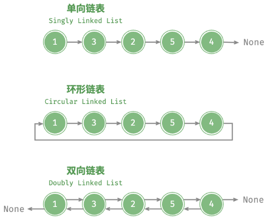

# 链表结构与变体

## 链表是什么？

- 定义: 由节点按引用串联而成的线性表, 节点存放相同类型的数据;
- 节点: 一个值 + 指向下一节点的引用;
- 与数组的差别: 节点不要求连续内存, 不能按下标随机访问, 但改指针即可插入删除;

## 头结点和尾结点分别起什么作用？

- 头结点: 值无意义的虚拟节点, 始终指向第一个真实结点或 `null`;
- 作用: 让"在第一个结点前插入/删除"与中间位置走同一段代码, 见 [哨兵节点](./030-哨兵节点.md);
- 尾结点: 下一引用为 `null` 的结点;

## 链表有哪些变体？

| 变体     | 节点结构             | 特点                                |
| -------- | -------------------- | ----------------------------------- |
| 单向链表 | 值 + `next`          | 只能单向遍历                        |
| 双向链表 | 值 + `prev` + `next` | 可前后遍历, 已知节点时删除为 $O(1)$ |
| 环形链表 | 单向/双向 + 尾接头   | 遍历必须有终止条件                  |

## 为什么链表不能按下标访问？

- 原因: 第 k 个结点的地址只能由前驱的 `next` 递推得到, 没有 `base + k * size` 这种计算;
- 后果: 访问是 $O(n)$, 依赖随机访问的排序与查找算法不能直接套用, 见 [链表排序](./070-链表排序.md);
