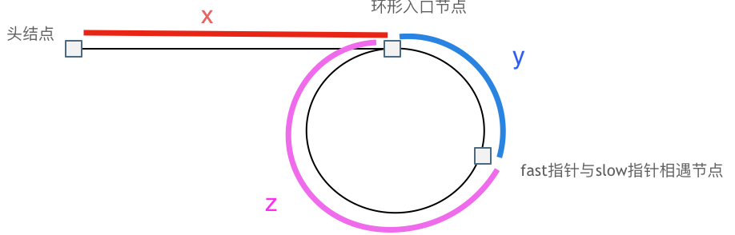

# 环形链表

## 如何判断链表是否有环？

- 做法: `slow` 走 1 步, `fast` 走 2 步;
- 有环: 两指针必在环内相遇 (相对速度 1, 环内距离持续缩小);
- 无环: `fast` 先到达 `null`;
- 时间 $O(n)$, 空间 $O(1)$;

```ts
const hasCycle = (head) => {
  let slow = head;
  let fast = head;
  while (fast && fast.next) {
    slow = slow.next;
    fast = fast.next.next;
    if (slow === fast) return true;
  }
  return false;
};
```

## 如何找到环的入口结点？

- 设: 头到入口为 $x$, 入口到相遇点为 $y$, 相遇点绕回入口为 $z$;
- 步数: `slow` 走 $x + y$; `fast` 走 $x + y + n(y + z)$;
- 由 $step(fast) = 2 \cdot step(slow)$ 得 $x = (n - 1)(y + z) + z$;
- 取 $n = 1$ 时 $x = z$: 从头与从相遇点各出发一个步长为 1 的指针, 相遇处即入口;



```ts
const detectCycle = (head) => {
  let slow = head;
  let fast = head;
  while (fast && fast.next) {
    slow = slow.next;
    fast = fast.next.next;
    if (slow === fast) {
      let res = head;
      while (res !== slow) {
        res = res.next;
        slow = slow.next;
      }
      return res;
    }
  }
  return null;
};
```

## 数组中的重复数为什么等价于找环入口？

- 建模: 把 `nums` 看成链表, 下标 `i` 是结点, `nums[i]` 是它的 `next`, 于是下一步是 `nums[nums[i]]`;
- 重复元素: 有两个下标指向同一结点, 该结点即环的入口;
- 结论: 直接套用找环入口的两段快慢指针;
- 注意: 不能改动数组 (否则可排序或标记下标);

```ts
const findDuplicate = (nums) => {
  let slow = 0;
  let fast = 0;
  while (true) {
    slow = nums[slow];
    fast = nums[nums[fast]];
    if (slow === fast) break;
  }
  let finder = 0;
  while (finder !== slow) {
    slow = nums[slow];
    finder = nums[finder];
  }
  return finder;
};
```
