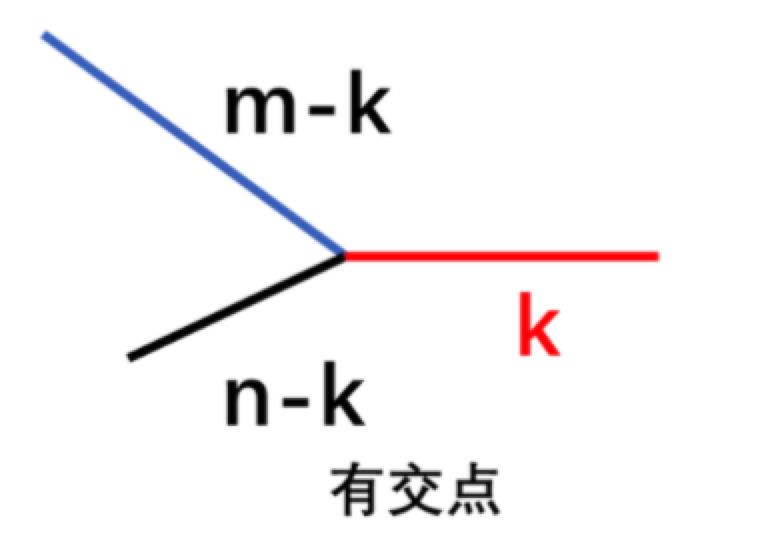
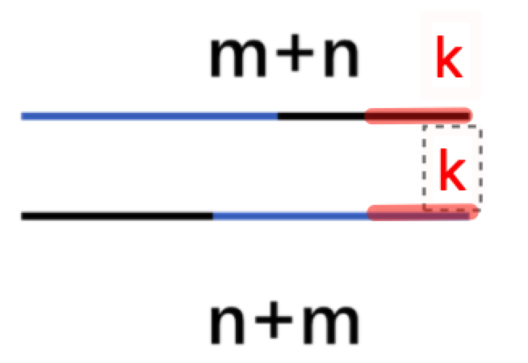

# 两个链表的遍历

## 如何合并两条有序链表？

- 模式: 分离双指针, `l1`、`l2` 各指一条链, 每次把值小的结点接到结果链尾;
- 哨兵: 用 `dummy` 作为结果链锚点, 返回 `dummy.next`;
- 收尾: 一条链走空后, 直接把另一条的剩余部分整体挂上;
- 时间 $O(m + n)$, 空间 $O(1)$;

```ts
const mergeTwoLists = (list1, list2) => {
  const dummy = new ListNode(0);
  let cur = dummy;
  while (list1 && list2) {
    if (list1.val < list2.val) {
      cur.next = list1;
      list1 = list1.next;
    } else {
      cur.next = list2;
      list2 = list2.next;
    }
    cur = cur.next;
  }
  cur.next = list1 ?? list2;
  return dummy.next;
};
```

## 如何用长度对齐找两条链表的交点？

- 性质: 相交之后两条链共享完全相同的结点序列, 因此尾部等长;
- 做法: 分别求长度 → 让长链先走长度差步 → 同步推进直到结点相同或走空;
- 注意: 比较的是结点引用 (`!==`), 不是 `val`;
- 时间 $O(m + n)$, 空间 $O(1)$;




```ts
const getIntersectionNode = (headA, headB) => {
  let lenA = 0;
  let lenB = 0;
  for (let p = headA; p; p = p.next) lenA++;
  for (let p = headB; p; p = p.next) lenB++;

  let pA = headA;
  let pB = headB;
  let sub = Math.abs(lenA - lenB);
  while (sub > 0) {
    if (lenA > lenB) pA = pA.next;
    else pB = pB.next;
    sub--;
  }

  while (pA && pB && pA !== pB) {
    pA = pA.next;
    pB = pB.next;
  }
  return pA;
};
```

## 奇升偶降链表如何整体升序？

- 输入: 奇数位升序、偶数位降序的单链表;
- 步骤: 按奇偶拆成两条链 (见 [链表分组](./100-链表分组.md)) → 反转偶数链 (见 [反转链表](./040-反转链表.md)) → 合并两条有序链;
- 时间 $O(n)$, 空间 $O(1)$;
