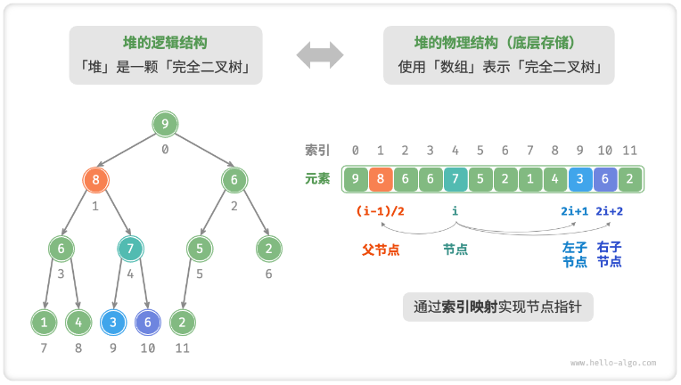

# 堆与完全二叉树

## 堆是什么？

- 堆: 满足特定条件的完全二叉树;
- 大顶堆: 任意节点的值大于等于其子节点的值, 根节点是最大值;
- 小顶堆: 任意节点的值小于等于其子节点的值, 根节点是最小值;
- 堆顶: 根节点;
- 堆底: 底层最靠右的节点;

## 为什么堆可以用数组存储？

- 前提: 堆是完全二叉树, 除最后一层外每层填满, 且最后一层靠左排列;
- 结论: 层序编号连续且没有空洞, 可以直接映射到数组下标;



- 下标映射: 节点 `i` 的左子为 `2i + 1`, 右子为 `2i + 2`, 父节点为 `⌊(i - 1) / 2⌋`;
- 收益: 不需要指针, 定位父子节点是 O(1) 的算术运算;

## 如何访问堆顶元素？

- 堆顶即数组下标 `0` 的元素;
- 时间复杂度: O(1);

## 入堆时元素如何上浮？

- 第一步: 把新元素追加到堆底, 维持完全二叉树的结构;
- 第二步: 自底向顶比较, 若新元素大于父节点则交换两者;
- 终止: 无需交换或已经到达根节点;
- 复杂度: O(log n), 即树高;

```typescript
function siftUp(nums: number[], i: number): void {
  while (i > 0) {
    const parent = Math.floor((i - 1) / 2);
    if (nums[i] <= nums[parent]) break;
    [nums[i], nums[parent]] = [nums[parent], nums[i]];
    i = parent;
  }
}

function push(nums: number[], value: number): void {
  nums.push(value);
  siftUp(nums, nums.length - 1);
}
```

## 出堆时元素如何下沉？

- 第一步: 交换堆顶元素与堆底元素;
- 第二步: 删除堆底元素, 此时原堆顶已被移出;
- 第三步: 自顶向底比较, 若当前元素小于较大的子节点则与之交换;
- 终止: 无需交换或已经到达叶子节点;
- 复杂度: O(log n);

```typescript
function siftDown(nums: number[], n: number, i: number): void {
  while (true) {
    const left = 2 * i + 1;
    const right = 2 * i + 2;
    let max = i;
    if (left < n && nums[left] > nums[max]) max = left;
    if (right < n && nums[right] > nums[max]) max = right;
    if (max === i) break;
    [nums[i], nums[max]] = [nums[max], nums[i]];
    i = max;
  }
}

function pop(nums: number[]): number | undefined {
  [nums[0], nums[nums.length - 1]] = [nums[nums.length - 1], nums[0]];
  const top = nums.pop();
  siftDown(nums, nums.length, 0);
  return top;
}
```

## 如何把一个无序数组堆化？

- 思路: 从最后一个非叶节点开始向前遍历, 对每个节点执行一次下沉;
- 起点: 最后一个非叶节点的下标为 `⌊n / 2⌋ - 1`;
- 复杂度: O(n), 优于逐个入堆的 O(n log n);

```typescript
function heapify(nums: number[]): void {
  for (let i = Math.floor(nums.length / 2) - 1; i >= 0; i--) {
    siftDown(nums, nums.length, i);
  }
}
```
