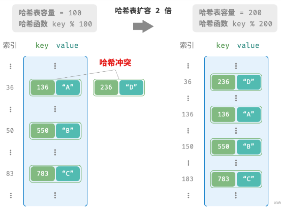

# 哈希扩容

## 为什么哈希表需要扩容？

- 目的: 减少哈希冲突;
- 原因: 元素数量接近桶数量时冲突概率上升, 链表变长, O(1) 退化;
- 代价: 扩容需要把已有元素重新散列, 计算开销极大;

## 负载因子如何触发扩容？

- 负载因子: 哈希表元素数量 / 桶数量;
- 触发: 负载因子达到设定阈值时执行扩容;
- 简单策略: 负载因子到达 0.75 时, 容量乘 2;
- 实践: 尽量预留足够大的容量, 减少扩容次数;
