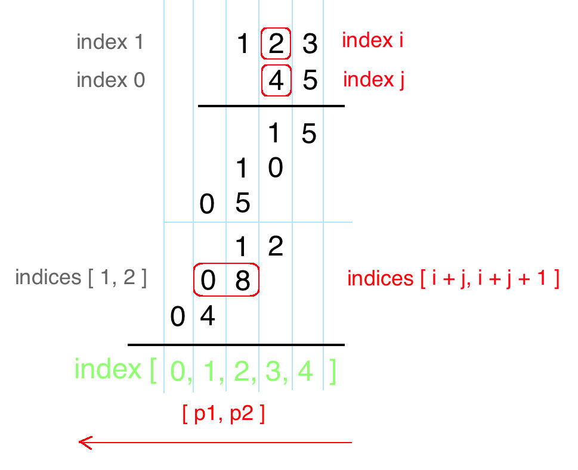

# 字符串数值模拟

## 如何把字符串转换为整数 (atoi)？

- 第一步: 去除首尾空格;
- 第二步: 判断符号位, `+` 或 `-` 只允许出现在数字之前;
- 第三步: 读取连续的字符数字, 遇到非数字字符即停止;
- 兜底: 没有读到数字字符时结果为 0;
- 截断: 结果超出 32 位有符号整数范围时截断到 `[-(2 ** 31), 2 ** 31 - 1]`;

```typescript
function myAtoi(s: string): number {
  s = s.trim();
  let sign = 1;
  let start = 0;

  if (s[0] === "+") start = 1;
  else if (s[0] === "-") {
    sign = -1;
    start = 1;
  }

  let digits = "";
  for (let i = start; i < s.length; i++) {
    if (!/\d/.test(s[i])) break;
    digits += s[i];
  }

  const num = sign * Number(digits || 0);
  return Math.min(Math.max(num, -(2 ** 31)), 2 ** 31 - 1);
}
```

## 字符串相乘为什么要按位对齐？

- 位数上限: 长度分别为 M 和 N 的两个数相乘, 结果最多 M + N 位;
- 对齐规则: `num1[i] × num2[j]` 的个位落在 `res[i + j + 1]`, 进位落在 `res[i + j]`;
- 步骤: 先把所有位乘积累加到 `res`, 再从低位到高位统一处理进位;
- 收尾: 去掉结果的前导零;
- 复杂度: 时间 O(m × n), 空间 O(m + n);



```typescript
function multiply(num1: string, num2: string): string {
  const m = num1.length;
  const n = num2.length;
  const res = new Array<number>(m + n).fill(0);

  for (let i = m - 1; i >= 0; i--) {
    for (let j = n - 1; j >= 0; j--) {
      const product = Number(num1[i]) * Number(num2[j]);
      res[i + j + 1] += product; // 先全部累加, 最后统一进位
    }
  }

  for (let i = m + n - 1; i > 0; i--) {
    res[i - 1] += Math.floor(res[i] / 10);
    res[i] %= 10;
  }

  const start = res[0] === 0 && res.length > 1 ? 1 : 0;
  return res.slice(start).join("");
}
```
