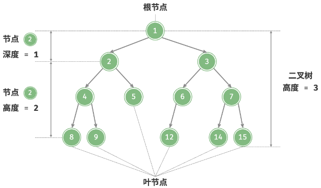

# 二叉树的定义与术语

## 二叉树是什么？

- 二叉树: 每个节点最多有两个子节点的非线性数据结构;
- 子节点: 分别为左子节点与右子节点, 以它们为根的子树称为左子树与右子树;
- 递归定义: 空树是二叉树; 根节点加上两棵互不相交的二叉树也是二叉树;
- 有序性: 左右子树位置固定, 交换后是不同的二叉树;

## 描述二叉树用到哪些术语？

| 术语   | 含义                               |
| ------ | ---------------------------------- |
| 根节点 | 树的顶部节点, 没有父节点           |
| 叶节点 | 没有子节点的节点                   |
| 边     | 连接父节点与子节点的线段           |
| 度     | 节点的子节点数量, 二叉树中为 0/1/2 |
| 层     | 从根向下递增, 根节点为第 1 层      |
| 深度   | 根节点到该节点经过的边数           |
| 高度   | 该节点到最远叶节点经过的边数       |

## 深度与高度有什么区别？

- 方向: 深度自顶向下计数, 高度自底向上计数;
- 基准: 根节点深度为 0, 它的高度等于整棵树的高度; 叶节点高度为 0;
- 易错: 有的教材把根节点记为第 1 层并把深度等同层数, 引用公式前先对齐口径;
