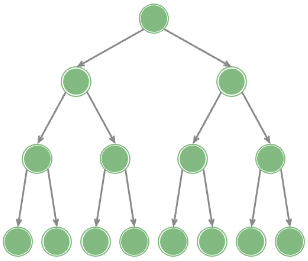
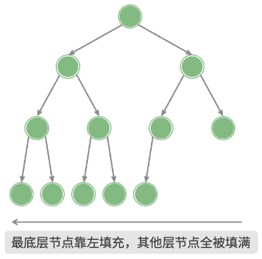
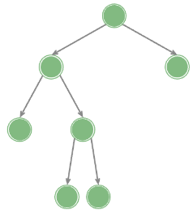
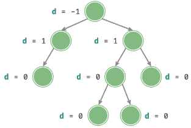
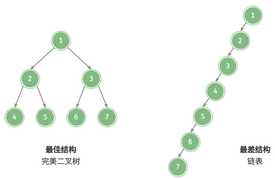

# 二叉树的类型

## 完美二叉树是什么？

- 定义: 所有层的节点都被填满;
- 等价说法: 高度为 h 的完美二叉树共有 2^(h+1) - 1 个节点;

## 完全二叉树是什么？

- 定义: 只有最底层可能未填满, 且最底层的节点从左向右连续靠拢;
- 用途: 可以直接用数组紧凑存储, 堆就是完全二叉树;

## 完满二叉树是什么？

- 定义: 除叶节点外的每个节点都有两个子节点;
- 与完全二叉树的区别: 允许底层的空位出现在任意位置, 不要求连续靠左;

## 平衡二叉树是什么？

- 定义: 任一节点的左右子树高度差都不超过 1;
- 意义: 把树高约束在 O(log n), 避免操作退化为线性;

## 二叉树为什么会退化？

- 退化: 所有节点都偏向同一侧, 结构变成单链表;
- 后果: 查找、插入、删除从 O(log n) 变为 O(n);
- 对策: 用 AVL 树等自平衡结构约束高度差, 见 [插入删除与再平衡](../050-AVL树/030-插入删除与再平衡.md);

