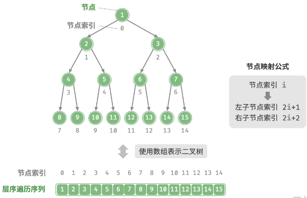
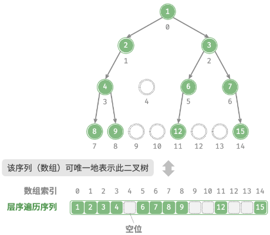

# 二叉树的数组表示与计数公式

## 如何用数组表示二叉树？

- 下标规则: 根节点下标 0; 下标 i 的左子节点为 `2i + 1`, 右子节点为 `2i + 2`, 父节点为 `floor((i - 1) / 2)`;
- 完美二叉树: 数组被连续填满, 没有空洞;

- 任意二叉树: 缺失的位置要留空占位, 稀疏时会出现大量空洞;

## 数组表示的优缺点是什么？

- 优点: 下标直接定位, 访问与遍历快, 支持随机访问;
- 缺点: 插入与删除要搬移元素, 稀疏树的空洞浪费空间, 不适合持续增删或过大的树;

## 二叉树有哪些常用计数公式？

| 结论                  | 公式                | 条件                |
| --------------------- | ------------------- | ------------------- |
| 第 k 层最多节点数     | `2^(k-1)`           | k 从 1 开始         |
| 高度 k 的树最多节点数 | `2^k - 1`           | 即完美二叉树        |
| 叶节点数              | 度为 2 的节点数 + 1 | 度为 1 的节点数未知 |
| N 个节点的最小层数    | `floor(log2 N) + 1` | 每层尽量填满        |

- 推导依据: 每层节点数最多是上一层的两倍, 总节点数按等比数列求和;
