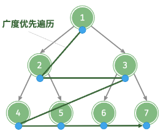

# 层序遍历

## 层序遍历是什么？

- 定义: 从根节点开始, 逐层从左到右访问所有节点;
- 本质: 图的广度优先遍历在二叉树上的特化;
- 复杂度: 时间 O(n), 空间 O(n);



## 如何用队列实现层序遍历？

- 步骤: 根节点入队 → 每轮先记录当前队列长度 size → 弹出 size 个节点并把它们的子节点入队 → 这一轮弹出的节点构成一层;

```js
const levelOrder = (root) => {
  if (root == null) return [];
  const res = [];
  const queue = [root];

  while (queue.length !== 0) {
    const level = [];
    const size = queue.length;
    for (let i = 0; i < size; i++) {
      const node = queue.shift();
      level.push(node.val);
      if (node.left != null) queue.push(node.left);
      if (node.right != null) queue.push(node.right);
    }
    res.push(level);
  }

  return res;
};
```

## 为什么每轮必须先固定 size？

- 原因: 子节点入队会改变队列长度, 不先固定就无法划分层次;
- 复用: 只要问题需要按层处理信息, 都沿用 "队列 + 每轮 size" 这个骨架, 见 [层序变种](../030-二叉树技巧/030-层序变种.md);
