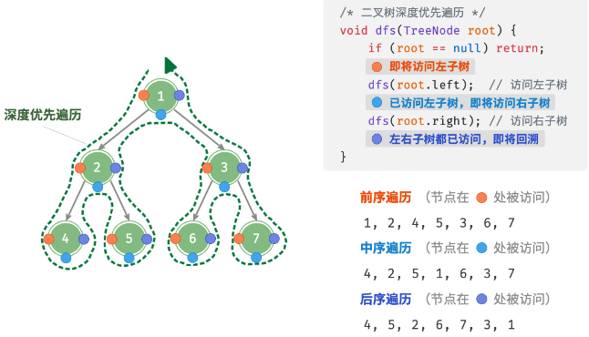

# 前中后序遍历

## 前序、中序、后序遍历如何区分？

- 依据: 根节点相对于左右子树的访问顺序;
- 前序: 根 → 左 → 右;
- 中序: 左 → 根 → 右;
- 后序: 左 → 右 → 根;
- 共性: 都属于深度优先遍历, 时间 O(n), 空间 O(n) 递归栈;



## 递归模板如何写？

```js
const preorder = (node, res = []) => {
  if (node == null) return res;
  res.push(node.val);
  preorder(node.left, res);
  preorder(node.right, res);
  return res;
};
```

- 换序: 把 `res.push` 移到两次递归之间就是中序, 移到之后就是后序;
- 变体: 需要维护路径时, 在进入与退出节点处配对增删状态, 见 [自顶向下的状态传递](../030-二叉树技巧/010-自顶向下的状态传递.md);

## 三种顺序各自适合解决什么问题？

| 顺序 | 典型用途                                 |
| ---- | ---------------------------------------- |
| 前序 | 复制树, 序列化, 自顶向下传递状态         |
| 中序 | 二叉搜索树升序输出, 用根切分左右子树区间 |
| 后序 | 先处理子树再汇总, 计算高度、路径、贡献值 |

## 为什么说后序位置适合汇总子树信息？

- 时机: 后序在左右子树都返回后才访问根节点, 此时子树信息已经完整;
- 套路: 递归函数返回 "对父节点有用" 的子树信息, 同时用闭包变量记录全局答案;
- 应用: 最大深度、平衡判断、直径、最大路径和都建立在这一模式上, 见 [自底向上的信息聚合](../030-二叉树技巧/020-自底向上的信息聚合.md);
