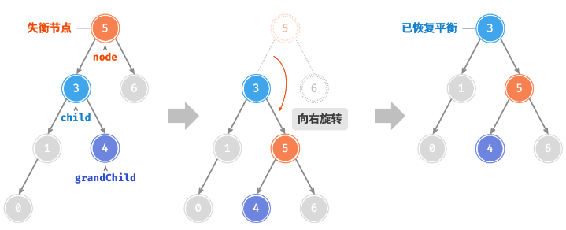
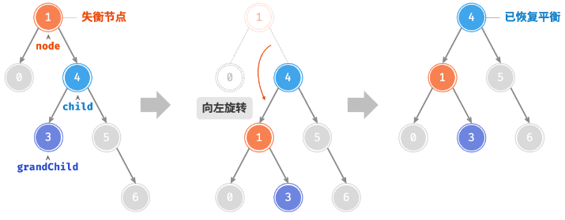
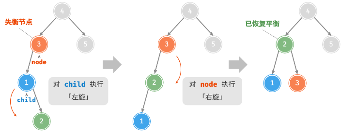
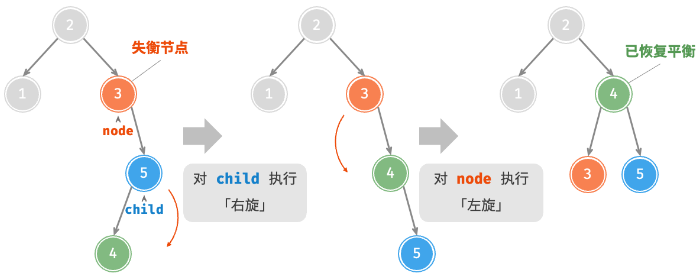
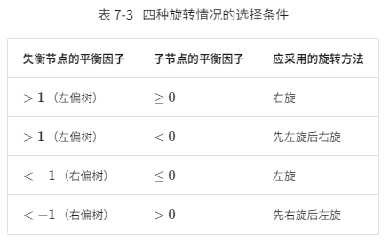

# 四种旋转

## 旋转为什么不会破坏二叉搜索树性质？

- 局部性: 旋转只调整三个节点之间的父子指针, 不移动其他子树;
- 顺序不变: 旋转前后中序遍历结果相同, 因此左小右大的关系保持;
- 目标: 降低高的那一侧, 让失衡节点恢复平衡;

## 右旋如何实现？

- 适用: 左左型失衡, 即失衡节点左子树更高, 且左孩子的左子树不矮于其右子树;
- 操作: 左孩子上提为新根, 它原来的右子树改挂到原根的左边;



```js
const rightRotate = (node) => {
  const child = node.left;
  node.left = child.right;
  child.right = node;
  return child;
};
```

## 左旋如何实现？

- 适用: 右右型失衡;
- 操作: 右孩子上提为新根, 它原来的左子树改挂到原根的右边;



```js
const leftRotate = (node) => {
  const child = node.right;
  node.right = child.left;
  child.left = node;
  return child;
};
```

## 左右型失衡为什么要先左旋再右旋？

- 场景: 失衡节点的左孩子右子树更高, 直接右旋后会变成右重;
- 步骤: 先对左孩子左旋, 把形状变成左左型, 再对失衡节点右旋;



```js
const leftRightRotate = (node) => {
  node.left = leftRotate(node.left);
  return rightRotate(node);
};
```

## 右左型失衡为什么要先右旋再左旋？

- 场景: 失衡节点的右孩子左子树更高;
- 步骤: 先对右孩子右旋变成右右型, 再对失衡节点左旋;



```js
const rightLeftRotate = (node) => {
  node.right = rightRotate(node.right);
  return leftRotate(node);
};
```

## 如何根据平衡因子选择旋转方式？

| 失衡节点平衡因子 | 孩子平衡因子 | 旋转         |
| ---------------- | ------------ | ------------ |
| 大于 1 (左重)    | 大于 0       | 右旋         |
| 大于 1 (左重)    | 小于 0       | 先左旋后右旋 |
| 小于 -1 (右重)   | 大于 0       | 先右旋后左旋 |
| 小于 -1 (右重)   | 小于 0       | 左旋         |


