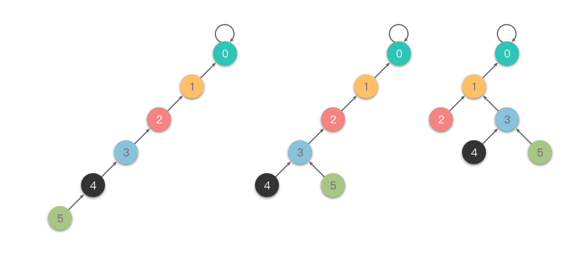

# 快速合并与路径压缩

## 快速合并如何表示集合？

- 表示: 森林加父指针数组 `fa`, 一棵树就是一个集合, 树根是集合代表;
- 合并: 把一棵树的根挂到另一棵树的根下面, 即 `fa[rootX] = rootY`;
- 查找: 沿父指针上溯到根节点;

```js
class UnionFind {
  constructor(n) {
    this.fa = Array.from({ length: n }, (_, i) => i);
  }

  find(x) {
    while (this.fa[x] !== x) {
      this.fa[x] = this.fa[this.fa[x]]; // 隔代压缩: 父指针上移一层
      x = this.fa[x];
    }
    return x;
  }

  union(x, y) {
    const rootX = this.find(x);
    const rootY = this.find(y);
    if (rootX === rootY) return false;
    this.fa[rootX] = rootY;
    return true;
  }

  isConnected(x, y) {
    return this.find(x) === this.find(y);
  }
}
```

## 路径压缩为什么有效？

- 问题: 只按父指针合并可能让树长成一条链, 查找退化为 O(n);
- 手段: 查找途中顺手把当前节点的父指针上移一层 (隔代压缩, 也叫路径减半);
- 效果: 反复查找后路径被摊薄, 单次操作近似常数时间;



- 另一种写法: 递归把路径上所有节点直接指向根 (完全压缩), 代价是多一层递归栈;

## 树的形态会影响合并结果吗？

- 风险: 固定把 `rootX` 挂到 `rootY` 下, 可能让某棵树越接越深;
- 优化: 按秩或按大小合并, 把节点少、高度小的树挂到另一棵下面;
- 复杂度: 路径压缩配合按秩合并时, 单次操作均摊 O(α(n)), α 为反阿克曼函数, 实际可视作常数;
