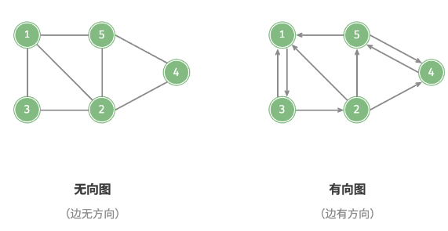
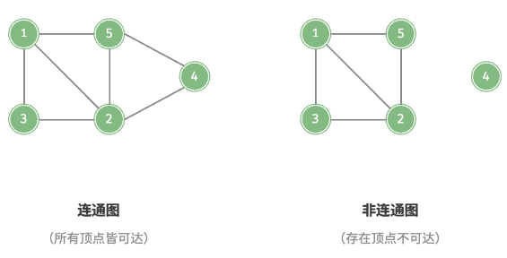
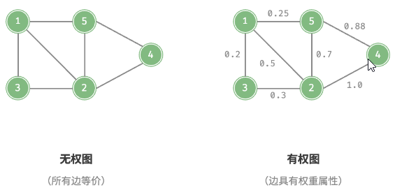

# 图的定义、术语与类型

## 图是什么？

- 定义: 由顶点集合 V 与边集合 E 组成的非线性数据结构, 记作 G = (V, E);
- 与树的区别: 图没有根节点, 允许任意连接与环;
- 与线性结构的区别: 元素之间是多对多关系, 没有天然的顺序;

## 图有哪些常用术语？

| 术语 | 含义                                     |
| ---- | ---------------------------------------- |
| 邻接 | 两顶点之间存在边                         |
| 路径 | 从一个顶点到另一个顶点经过的边构成的序列 |
| 度   | 与该顶点相连的边数                       |
| 入度 | 指向该顶点的边数 (有向图)                |
| 出度 | 从该顶点指出的边数 (有向图)              |

- 无向图的性质: 所有顶点的度数之和等于边数的两倍;
- 有向图的性质: 所有顶点的入度之和与出度之和相等, 都等于边数;

## 有向图和无向图如何区分？

- 判定: 边是否具有方向;
- 无向图: 边是双向的, 邻接关系对称, 转成矩阵后关于主对角线对称;
- 有向图: 边从起点指向终点, 需要区分入度与出度;

## 连通图和非连通图如何区分？

- 连通图: 从任一顶点出发都能到达其余所有顶点 (无向图口径);
- 非连通图: 存在无法互相到达的顶点, 图被分成多个连通块;
- 有向图口径: 对应概念是强连通与弱连通;

## 无权图和有权图如何区分？

- 判定: 边是否带有权重;
- 无权图: 边只表达 "是否相连";
- 有权图: 边权表示距离、代价或容量, 最短路与最小生成树都在有权图上讨论;

## 什么是有向无环图？

- 有向无环图 (DAG): 不存在任何有向环的有向图;
- 判定: 拓扑排序结果包含全部顶点当且仅当该图是 DAG, 见 [拓扑排序](../030-拓扑排序/010-拓扑排序.md);
