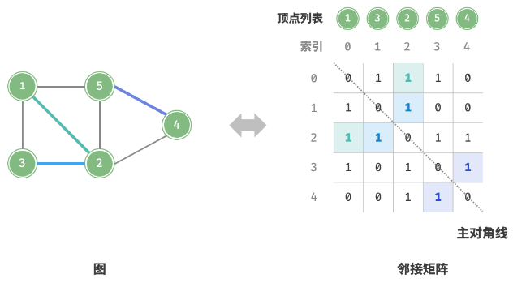
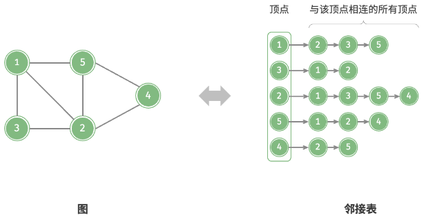

# 图的两种表示

## 邻接矩阵如何表示图？

- 定义: 用 n * n 矩阵表示 n 个顶点之间的连接, `adjMat[i][j] = 1` 表示存在边;
- 无向图: 矩阵关于主对角线对称, 增删边要同时改写两个位置;
- 有向图: 只写 `adjMat[i][j]`;
- 主对角线: 表示顶点与自身的关系, 通常恒为 0;

## 邻接表如何表示图？

- 定义: 每个顶点维护一个容器, 保存它的全部邻接顶点;
- 容器选择: 用链表或数组时判断邻接要 O(m); 换成哈希表 (Set/Map) 后增删边与判断邻接都是 O(1);
- 空间: O(V + E), 远小于邻接矩阵;

## 两种表示如何选择？

| 操作         | 邻接矩阵 | 邻接表 (链表) | 邻接表 (哈希表) |
| ------------ | -------- | ------------- | --------------- |
| 判断是否邻接 | O(1)     | O(m)          | O(1)            |
| 添加边       | O(1)     | O(n)          | O(1)            |
| 删除边       | O(1)     | O(m)          | O(1)            |
| 添加顶点     | O(n)     | O(1)          | O(1)            |
| 删除顶点     | O(n^2)   | O(n + m)      | O(n)            |
| 占用空间     | O(n^2)   | O(n + m)      | O(n + m)        |

- n 为顶点数, m 为边数;
- 稠密图: 邻接矩阵常数更小, 实现更简单;
- 稀疏图: 邻接表空间占优, 也是遍历类题目的默认选择;
- 具体增删实现见 [图的基本操作](./040-图的基本操作.md);
