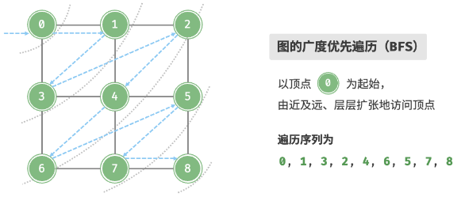

# 广度优先遍历

## 广度优先遍历的思路是什么？

- 顺序: 从起点出发先访问它的全部邻接顶点, 再按访问顺序逐层向外扩展;
- 数据结构: 队列 + 访问标记;
- 附加性质: 无权图上第一次到达某顶点的层数就是最短路径长度;

## 队列实现怎么写？

- 起点入队并标记;
- 每轮出队一个顶点, 把未访问的邻接顶点入队并标记;
- 标记时机: 必须在入队时完成, 否则同一顶点会被重复入队;



```js
const bfs = (graph, start) => {
  const visited = new Set([start]);
  const queue = [start];
  const res = [start];

  while (queue.length !== 0) {
    const node = queue.shift();
    for (const next of graph[node]) {
      if (visited.has(next)) continue;
      visited.add(next);
      res.push(next);
      queue.push(next);
    }
  }

  return res;
};
```

## 复杂度如何？

- 时间: O(V + E), 每个顶点入队一次, 每条边被检查一次;
- 空间: O(V), 队列与访问标记;
- 非连通图: 需要对每个未访问顶点各调用一次, 才能覆盖全部连通块;
- 对比: 树是特殊的图, 层序遍历就是起点为根的广度优先遍历, 见 [层序遍历](../../090-树/020-二叉树遍历/010-层序遍历.md);
