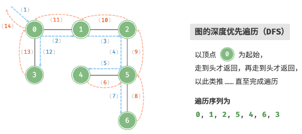

# 深度优先遍历

## 深度优先遍历的思路是什么？

- 顺序: 从起点出发沿一条边一直走到底, 走不通再回退到上一个分叉;
- 数据结构: 访问标记 + 递归调用栈 (或显式栈);

## 递归实现怎么写？

- 进入前标记, 保证每个顶点只被访问一次;
- 对每个未访问的邻接顶点递归下去;



```js
const dfs = (graph, start) => {
  const visited = new Set([start]);
  const res = [start];

  const loop = (node) => {
    for (const next of graph[node]) {
      if (visited.has(next)) continue;
      visited.add(next);
      res.push(next);
      loop(next);
    }
  };

  loop(start);
  return res;
};
```

## 显式栈实现为什么与递归顺序不同？

- 原因: 栈后进先出, 同一顶点的邻接顶点被颠倒入栈, 出栈顺序随之颠倒;
- 结论: 遍历序列可能不同, 但两者都是合法的深度优先序列;

```js
const dfsStack = (graph, start) => {
  const visited = new Set([start]);
  const stack = [start];
  const res = [start];

  while (stack.length !== 0) {
    const node = stack.pop();
    for (const next of graph[node]) {
      if (visited.has(next)) continue;
      visited.add(next);
      res.push(next);
      stack.push(next);
    }
  }

  return res;
};
```

## 复杂度如何？

- 时间: O(V + E);
- 空间: O(V), 递归栈或显式栈;
- 选择: 需要与递归一致的顺序时用递归; 图很深时用显式栈避免栈溢出;
