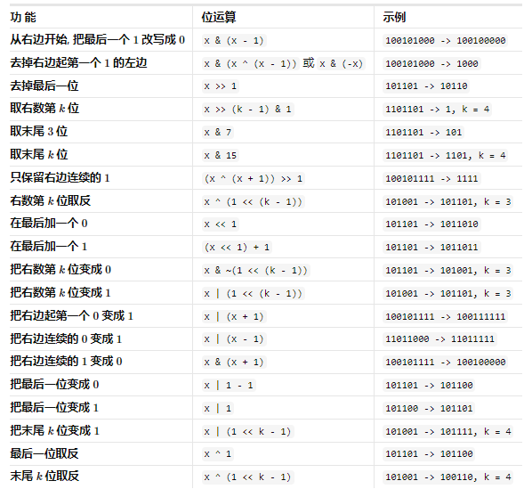

# 位运算

## 位运算符的规则是什么？

| 运算符 | 名称     | 规则                                        |
| ------ | -------- | ------------------------------------------- |
| `\|`   | 按位或   | 对应两位有一个为 1, 结果位为 1;             |
| `&`    | 按位与   | 对应两位都为 1, 结果位才为 1;               |
| `^`    | 按位异或 | 对应两位相异为 1, 相同为 0;                 |
| `~`    | 取反     | 每一位 1 变 0, 0 变 1;                      |
| `<<`   | 左移     | 各二进位左移若干位, 高位丢弃, 低位补 0;     |
| `>>`   | 右移     | 各二进位右移若干位, 低位丢弃, 高位补符号位; |

- 掩码: 构造一个只有指定位为 1、其余位为 0 的数, 与目标数做位运算即可只影响指定位;

## 如何用位运算判断奇偶与取指定位？

- 奇偶: 最低位为 0 是偶数, 为 1 是奇数;

```js
(x & 1) === 0; // 偶数
(x & 1) === 1; // 奇数
```

- 取指定位: 掩码与目标数按位与, 结果保留指定位;
- 置 1: 掩码与目标数按位或;
- 置 0: 掩码取反后与目标数按位与;
- 翻转: 掩码与目标数按位异或;

## 常见的二进制技巧有哪些？



- 记法: 技巧都是"构造掩码 → 选对运算符"的组合, 无需死记结果;

## 如何统计一个整数的位 1 个数？

```js
const hammingWeight = (n) => {
  let res = 0;
  while (n) {
    res += n & 1; // 取最低位
    n = n >> 1; // 右移一位
  }
  return res;
};
```

- 复杂度: 时间 $O(k)$ ($k$ 为位数), 空间 $O(1)$;
- 优化: `n &= n - 1` 每次消去最低位的 1, 循环次数等于 1 的个数;

## 异或为什么能找出缺失的数字？

- 性质: 异或满足交换律与结合律, 且 $a \oplus a = 0$, $a \oplus 0 = a$;
- 思路: 把 $[0, n]$ 与数组元素全部异或, 成对出现的数两两抵消, 剩下的就是缺失值;

```js
const missingNumber = (nums) => {
  let res = 0;
  for (let i = 1; i <= nums.length; i++) res ^= i;
  for (const num of nums) res ^= num;
  return res;
};
```

- 复杂度: 时间 $O(n)$, 空间 $O(1)$;
- 对比: 哈希集合做法同样 $O(n)$ 时间, 但需要 $O(n)$ 空间;
