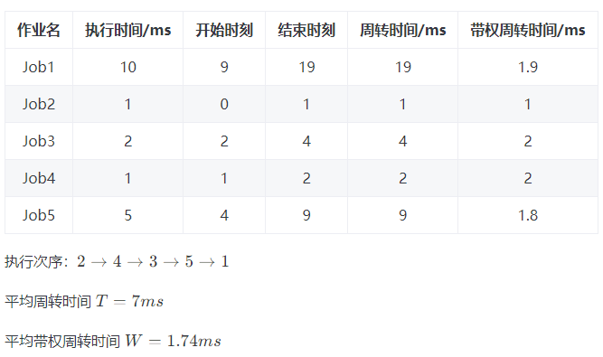

# 短作业优先调度

## 短作业优先解决什么问题？

- 场景: 有若干作业等待处理, 每个作业需要不同的执行时间;
- 目标: 让所有作业的平均周转时间最小;
- 策略: 按作业的执行时间升序排列, 时间短的先执行;
- 直觉: 短作业提前完成能减少后续所有作业的等待累积;

## 调度相关的指标如何计算？

- 周转时间: 完成时刻减去最初开始时刻;
- 带权周转时间: 周转时间除以该作业的执行时间;
- 平均周转时间 $\overline{T}$: 各作业周转时间之和除以作业个数;
- 平均带权周转时间 $\overline{W}$: 各作业带权周转时间之和除以作业个数;

## 如何计算一组作业的调度指标？

| 作业名 | 执行时间/ms | 开始时刻 | 结束时刻 | 周转时间/ms | 带权周转时间/ms |
| ------ | ----------- | -------- | -------- | ----------- | --------------- |
| Job1   | 10          | 9        | 19       | 19          | 1.9             |
| Job2   | 1           | 0        | 1        | 1           | 1               |
| Job3   | 2           | 2        | 4        | 4           | 2               |
| Job4   | 1           | 1        | 2        | 2           | 2               |
| Job5   | 5           | 4        | 9        | 9           | 1.8             |

- 执行次序: $2 \to 4 \to 3 \to 5 \to 1$;
- 平均周转时间: $\overline{T} = 7\,\text{ms}$;
- 平均带权周转时间: $\overline{W} = 1.74\,\text{ms}$;

- 读表要点: 结束时刻等于开始时刻加执行时间, 下一作业的开始时刻等于上一作业的结束时刻;
- 注意: Job1 的开始时刻是 9 而非 0, 因为前四个作业已占用 $[0, 9]$ 区间;
