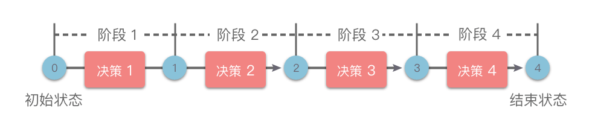

# 动态规划解题步骤

## 动态规划解题分哪几步？

- 四步: 划分阶段 → 定义状态 → 写出状态转移方程 → 确定初始条件和边界;
- 阶段: 按特定顺序把问题分解为互相联系的子问题, 完成前一阶段才能进入下一阶段;
- 决策: 阶段之间通过选择动作迁移, 迁移结果记录在状态里;



## 如何划分阶段？

- 依据: 按问题规模自然增长的维度推进, 如数组下标、字符串前缀长度、剩余容量、区间长度;
- 例: 爬楼梯按台阶数 `0..n`; 背包按物品序号; 区间 dp 按区间长度;
- 要求: 每个阶段的答案只依赖已经完成的阶段;

## 如何定义状态？

- 状态: 一组能唯一描述子问题、并足以支撑后续决策的最小变量;
- 记法: 一维 `dp[i]`、二维 `dp[i][j]`, 下标含义必须能用一句话说清;
- 检验: 反推"到达该状态的所有路径"是否都能用这组变量区分;
- 常见状态: 以 `nums[i]` 结尾、前 `i` 个元素、区间 `[i, j]`、前 `i` 件物品用容量 `c`;

## 如何写出状态转移方程？

- 做法: 枚举 `dp[大]` 的最后一个决策, 把问题拆成规模更小的状态;
- 例: 爬楼梯最后一步只能跨 1 阶或 2 阶, 故 `dp[i] = dp[i-1] + dp[i-2]`;
- 形式: 取最值用 `max`/`min`, 计数用求和, 判定用逻辑或;
- 定式: 大多数转移是"不选当前 + 选当前"两类候选的比较或合并;

## 如何确定初始条件和边界？

- 初始状态: 最小子问题的答案, 无法再拆的状态;
- 边界条件: 下标越界、容量为 0、空串等退化情形必须显式定义;
- 例: 斐波那契 `dp[0] = 0`、`dp[1] = 1`; 恰好装满类问题的初值见 [背包变种](../050-背包/040-背包变种.md);
- 终止条件: 填表方向保证依赖项先算好, 答案落在 `dp[n]`、`dp[n-1]` 或 `max(dp)`;

## 如何用四步解斐波那契与爬楼梯？

- 斐波那契:
  - 阶段: 按整数顺序划分;
  - 状态: `dp[i]` 为第 `i` 个斐波那契数;
  - 转移: `dp[i] = dp[i-1] + dp[i-2]`;
  - 初值: `dp[0] = 0`, `dp[1] = 1`; 边界: `i === n`;

```typescript
const fib = (n) => {
  const dp = new Array(n + 1);
  dp[0] = 0;
  dp[1] = 1;
  for (let i = 2; i <= n; i++) dp[i] = dp[i - 1] + dp[i - 2];
  return dp[n];
};
```

- 爬楼梯:
  - 阶段: 按楼梯阶层划分 `0..n`;
  - 状态: `dp[i]` 为爬到第 `i` 阶的方案数;
  - 转移: 上一步只能在 `i-1` 阶或 `i-2` 阶, 故 `dp[i] = dp[i-1] + dp[i-2]`;
  - 初值: `dp[1] = 1`, `dp[2] = 2`;
  - 复杂度: 时间 `O(n)`, 空间 `O(n)`;
