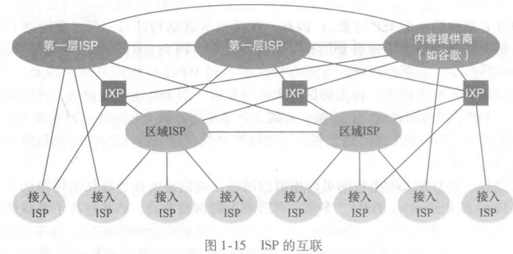

# 因特网的组成

## 因特网由哪些具体构件组成？

- 主机/端系统: 运行网络应用的设备, 如 PC、手机、服务器;
- 通信链路: 连接相邻设备的物理媒介, 传输速率决定带宽;
- 分组交换机: 转发分组的设备, 路由器位于网络核心, 链路层交换机位于接入网;
- ISP: 因特网服务提供商, 向端系统提供接入;
- 协议: 端系统与网络设备共同遵守的通信规则;
- 标准: RFC 文档定义协议细节;

## 什么是协议？

- 协议: 多个通信实体之间交换报文的格式与顺序, 以及收发报文时采取的动作;
- 规定内容: 交换的报文类型、报文语法与字段语义、发送与响应的时机规则;

## 套接字接口解决什么问题？

- 套接字接口: 端系统进程与另一台端系统进程交换数据的抽象;
- 作用: 屏蔽底层链路与分组交换细节, 只暴露发送与接收数据的规则;
- 位置: 应用层与运输层之间的编程接口;

## ISP 的层级结构与 IXP 是什么关系？

- 层级: 下级 ISP 接入上级 ISP, 越靠上层覆盖范围越大、速率越高;
- IXP: 第三方创建的汇集点, 多个 ISP 在此直接互联, 无需绕行上级 ISP;
- 目的: 降低跨 ISP 流量成本, 缩短转发路径;

