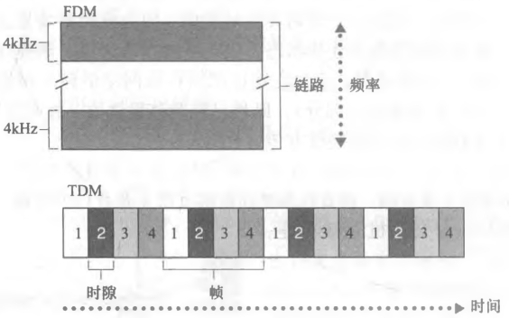

# 网络核心的分组交换与电路交换

## 分组交换如何传输数据？

- 分组: 把长报文切分成的小数据块, 附上首部后独立传输;
- 路径: 分组经过通信链路与分组交换机逐跳转发;
- 优势: 多用户共享链路时按需占用, 不必预留给空闲用户;
- 代价: 到达时间不确定, 存在排队与丢包;

## 存储转发与排队时延、丢包如何产生？

- 存储转发: 交换机必须收到整个分组后, 才能开始在输出链路上发送其第一个比特;
- 排队时延: 输出链路正忙时, 分组在输出缓存中等待;
- 丢包: 输出缓存已满时, 到达的分组或缓存中的某个分组被丢弃;
- 后果: 丢包需要上层协议重传, 是分组交换时延不可预测的根源;

## 转发表与路由选择协议的分工是什么？

- 转发表: 局部映射表, 按分组首部的 IP/MAC 字段把输入链路映射到输出链路;
- 转发: 查表并把分组移到对应输出链路, 属于数据平面动作;
- 路由选择协议: 自动计算并维护转发表, 属于控制平面动作;

## 电路交换如何预留资源？

- 语义: 通信开始前端到端之间预留专属链路资源;
- 特征: 建立连接后传输速率恒定, 时延可预测;
- 代价: 静默期资源被占用, 链路利用率低;

## 电路交换有哪些复用方式？

- 频分复用 (FDM): 链路按频段划分, 一条连接独占一个频段;
- 时分复用 (TDM): 时间划分为固定长度的帧, 每帧包含若干时隙, 一条连接独占一个时隙;
- 特点: 复用后单连接的速率固定为链路容量的一部分;

## 分组交换与电路交换如何取舍？

| 维度 | 分组交换         | 电路交换         |
| ---- | ---------------- | ---------------- |
| 效率 | 高, 按需共享     | 低, 静默也占资源 |
| 时延 | 不可预测, 有抖动 | 恒定             |
| 适用 | 突发性数据业务   | 持续恒定速率业务 |
