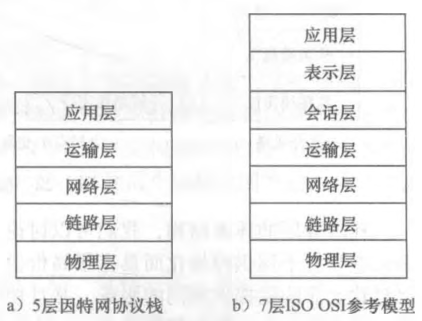

# 协议分层与封装

## 为什么要分层？

- 分层: 把复杂通信问题按职责拆成若干层, 每层只解决一类问题;
- 优点: 概念化、模块化, 单层实现替换不影响其他层;
- 约束: 某个协议固定属于某一层, 层间通过服务接口交互;

## 协议栈的两种常见模型是什么？

| 模型             | 层次                                                       |
| ---------------- | ---------------------------------------------------------- |
| 因特网协议栈     | 应用层、运输层、网络层、链路层、物理层                     |
| ISO OSI 参考模型 | 应用层、表示层、会话层、运输层、网络层、数据链路层、物理层 |

- 协议栈: 各层所有协议的集合;
- 相同点: 两层模型的下 4 层意义大致相同;

## OSI 的表示层与会话层在因特网模型中去哪了？

- 表示层: 负责数据如何描述与编码;
- 会话层: 负责数据交换、同步与恢复;
- 因特网模型: 这两层的职责被合并进应用层, 由应用程序自行处理;

## 封装如何逐层添加首部？

- 封装: 下一层把上一层分组当作数据, 在其前面追加本层首部;
- 过程: 应用报文 → 运输层报文段 → 网络层数据报 → 链路层帧;
- 解封装: 接收方逐层剥去首部, 把数据交给上一层;

