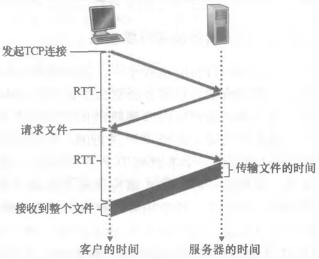

# HTTP 连接管理

## HTTP 的基本语义是什么？

- HTTP: 超文本传输协议, 定义 Web 客户端向 Web 服务器请求网页的方式;
- 规范: RFC 1945 与 RFC 2616;
- 运输层协议: 依赖 TCP 提供可靠传输;
- 无状态: 不保存客户端的任何历史信息, 状态需由 cookie 等外部机制维护;
- 协议交互的报文格式见 [HTTP 报文格式](./030-HTTP报文格式.md);

## 非持续连接与持续连接有什么区别？

- RTT (往返时间): 一个分组从客户端到服务器再返回客户端所花的时间;
- 非持续连接: 每个 HTTP 请求使用单独的 TCP 连接, 每次都要重新握手, 服务器负担重;
- 持续连接: 多个 HTTP 请求复用同一个 TCP 连接, 空闲一定时间后才关闭;
- 取舍: 持续连接减少握手与慢启动开销, 但服务器需为每个连接维持状态;

## 请求并接收一个 HTML 页面需要多少 RTT？

- 三次握手:
  - 第一次: 客户端向服务器发送一个小 TCP 报文段;
  - 第二次: 服务器回送一个小 TCP 报文段作为确认与响应;
  - 第三次: 客户端再发送一个小 TCP 报文段作为确认;
- 计时: 前两次握手消耗 1 个 RTT; 第三次握手与服务器传输 HTML 合计消耗 1 个 RTT;
- 结论: 非持续连接下总时间约为 2 个 RTT 加上服务器传输 HTML 的时间;

