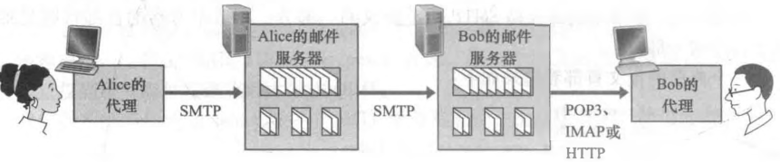

# 电子邮件与 SMTP

## 电子邮件系统由哪些部分组成？

- 用户代理: 用户读写邮件的客户端程序;
- 邮件服务器: 保存用户的收件箱与待发送邮件, 是系统的核心;
- SMTP: 邮件服务器之间以及用户代理到邮件服务器之间传递邮件的协议;


## SMTP 如何传递邮件？

- 基础: 基于 TCP, 由 RFC 5321 定义;
- 作用范围: 发送方用户代理 → 发送方邮件服务器 → 接收方邮件服务器;
- 直接连接: 不使用中间邮件服务器, 两个邮件服务器直连;
- 重试: 接收方邮件服务器不可用时, 邮件暂存在发送方服务器并周期性重试;

## SMTP 与 HTTP 有什么区别？

| 维度     | HTTP                       | SMTP                   |
| -------- | -------------------------- | ---------------------- |
| 拉取方向 | pull, 用户从服务器拉取     | push, 用户向服务器推送 |
| 数据类型 | 不受限制                   | 仅 7 bit ASCII         |
| 封装方式 | 每个对象封装进一个响应报文 | 所有对象封装进一个报文 |

## 邮件报文格式是什么？

- 报文首部: 若干首部行, 如 `From`、`To`、`Subject`;
- 空行: 分隔首部与正文;
- 报文体: ASCII 表示的邮件内容;

```json
From: test@test.test
To: tt@tt.tt
Subject: test
```

## 邮件访问协议解决什么问题？

- 问题: SMTP 只负责推送, 用户代理无法用 SMTP 从服务器读取邮件;
- 方案: 用邮件访问协议从邮件服务器拉取邮件;
- 常见协议: POP3 与 IMAP;
- 基于 HTTP 的邮箱: 只有邮件服务器之间使用 SMTP, 用户代理到服务器改用 HTTP;


