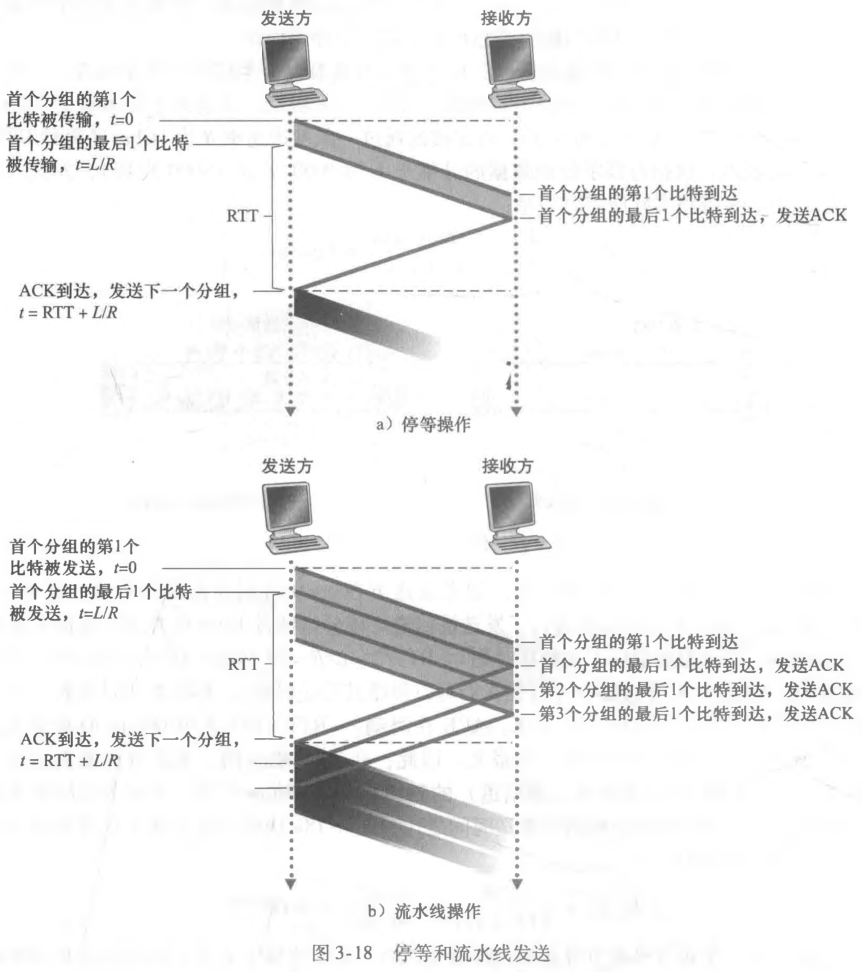

# 流水线与回退 N 步

## 停等协议为什么浪费链路？

- 比特交替协议本质是停等协议: 一个 RTT 内只允许一个分组在途;
- 后果: 链路容量远大于单个分组的传输速率, 链路长期空闲;

## 流水线需要满足哪些条件？

- 流水线: 允许发送方连续发送多个分组而不必逐个等待确认;
- 序号范围: 必须扩大, 以区分在途的多个分组;
- 缓存: 发送方与接收方都要能缓存多个分组的状态;

## 回退 N 步协议的发送方如何工作？

- 窗口: 在流水线上确定长度为 N 的发送窗口;
- 定时器: 只为最左侧已发送未确认的分组设置一个定时器;
- 超时: 一旦超时, 重传窗口内所有已发送但未确认的分组;
- 滑动: 窗口随着最左侧分组被确认而向右滑动;

## 回退 N 步协议的接收方如何工作？

- 失序处理: 收到失序分组直接丢弃, 不缓存;
- 等待: 只按序接收窗口内的分组, 直到缺失分组到达;
- 代价: 单个分组丢失会导致其后所有已发送分组被重传;

