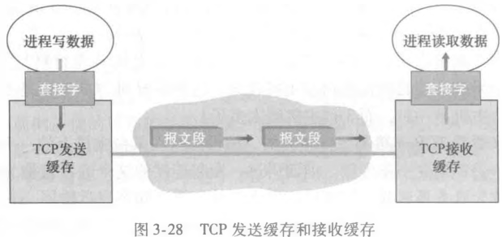
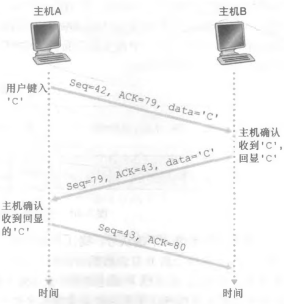

# TCP 连接与报文段

## TCP 连接有哪些特性？

- 面向连接: 两个进程发送数据前必须互相握手, 确定数据传输参数;
- 全双工: 两端可同时收发数据;
- 点对点: 一条连接只连接两个端点;

## 发送缓存与接收缓存如何配合？

- 建立时机: 在三次握手期间设置;
- 发送缓存: TCP 通过套接字接收应用数据存入发送缓存, 并不定时取出一块交给网络层发送;
- 接收缓存: TCP 接收网络层数据存入接收缓存, 再通过套接字交付给进程;
- 作用: 解耦应用层读写速度与网络发送速率, 是流量控制的载体;

## MSS 与 MTU 是什么关系？

- MSS: 最大报文段长度, 即 TCP 报文段中数据字段的最大值;
- MTU: 最大传输单元, 即链路层帧能承载的最大长度;
- 关系: 经典取值 MSS 为 1460 字节, MTU 为 1460 + 40 字节, 其中 40 字节是 TCP 与 IP 首部;

## TCP 报文段由哪些字段构成？

- 首部字段: 源端口号、目标端口号、检验和、序号、接收窗口、首部长度、选项、标志;
- 数据字段: 应用层报文;
- 接收窗口: 用于流量控制的 `rwnd` 值;

## 序号与确认号分别表示什么？

- 序号 (Seq): 本报文段首字节在整个字节流中的编号; 之后各段的 Seq 等于对方最新 ACK 号; 双方起始序号不必相同;
- 确认号 (ACK): 期望收到的下一个字节的序号, 即第一个尚未被确认的字节;
- 累计确认: 确认号之前的所有字节都已被正确接收;

## 失序到达时 TCP 如何处理？

- 规范: RFC 未规定接收方处理失序报文段的方式;
- 可选策略: 回退 N 步或选择重传;
- 实际实现: 一般采用选择重传, 缓存失序报文段;

