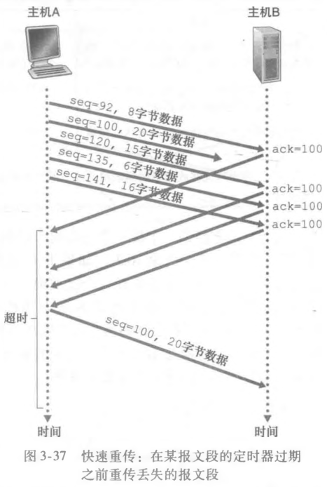

# TCP 可靠传输与快速重传

## TCP 重传定时器如何使用？

- 规范: RFC 6298 推荐只使用单一重传定时器;
- 管理对象: 只记录具有最小序号的已发送未确认报文段;
- 触发: 定时器超时后重传该报文段;

## 简化的 TCP 发送方处理哪些事件？

- 三个事件: 收到应用层数据、定时器超时、收到 ACK;
- 关键变量: `NextSeqNum` 为下一个报文段首字节的字节流编号, `SendBase` 为字节流中第一个已发送但未被确认的字节序号;
- 差错检验: 依靠报文段首部的检验和;

## 超时间隔为什么要加倍？

- 现象: TCP 每次重传时并不使用重新计算的超时间隔;
- 做法: 每超时一次就把超时间隔加倍;
- 目的: 避免在网络持续拥塞时不断以过短间隔重传, 加剧拥塞;

## 快速重传如何工作？

- 冗余 ACK 的产生:
  - 期望的报文段按序到达: 正常发送对应的 ACK a;
  - 失序报文段到达: 立刻再次发送冗余 ACK a;
- 触发条件: 发送方收到 3 个冗余 ACK 就立即重传缺失的报文段, 不等定时器超时;

## TCP 更像 GBN 还是 SR？

- 像 GBN 的地方: 发送方只使用单一计时器, 且只记录发送过但未确认的最小序号;
- 像 SR 的地方: 每次重传最多只重传一个报文段 (即发送未确认的最小序号); 接收方用窗口记录失序报文段;
- 结论: TCP 是 GBN 与 SR 的混合体;
