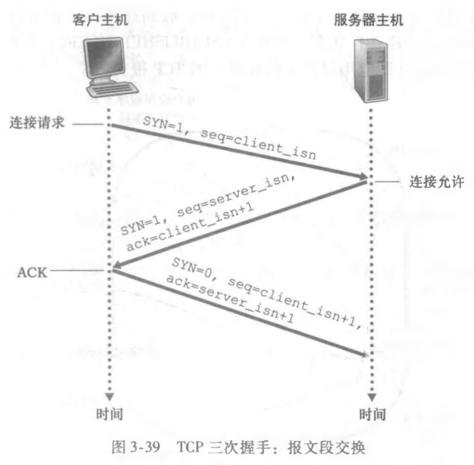

# TCP 三次握手与四次挥手

## 第一次握手做什么？

- 客户端向服务器发送 SYN 报文段;
- 首部 SYN 标志置 1;
- 设置客户端初始序号 `client_isn`;
- 该报文段不携带应用层数据;

## 第二次握手做什么？

- 服务器收到 SYN 报文段, 为该连接分配 TCP 缓存与变量;
- 服务器回送 SYNACK 报文段: SYN 置 1、ACK 字段为 `client_isn + 1`、并携带服务器初始序号 `server_isn`;
- 该报文段不携带应用层数据;

## 第三次握手做什么？

- 客户端收到 SYNACK 报文段, 为该连接分配 TCP 缓存与变量;
- 客户端回送确认报文段: SYN 置 0、ACK 字段为 `server_isn + 1`;
- 该报文段可以携带应用层数据;

## 三次握手分别验证了谁的收发能力？

| 步骤   | 验证结果                                     |
| ------ | -------------------------------------------- |
| 第一次 | 服务器确认: 自己的接收能力正常、客户端在发送 |
| 第二次 | 客户端确认: 双方的发送与接收能力都正常       |
| 第三次 | 服务器确认: 客户端的接收能力正常             |

## 四次挥手每一步做什么？

1. 主动关闭方 (通常是客户端) 发送终止报文段: FIN 置 1, 携带 `client_isn`;
2. 服务器收到后回送确认报文段, ACK 为 `client_isn + 1`;
3. 服务器把剩余数据全部发送完毕后, 发送自己的终止报文段: FIN 置 1, 携带 `server_isn`;
4. 客户端收到后回送确认报文段, ACK 为 `server_isn + 1`;

## 为什么关闭连接需要四次挥手？

- 原因: 收到对方 FIN 时, 本端可能仍有未处理完的数据;
- 做法: 先回送 ACK 确认已收到终止请求, 继续发送剩余数据, 全部发完后再发送本端的 FIN;
- 效果: 保证双方都正确关闭连接且数据全部处理完毕;
