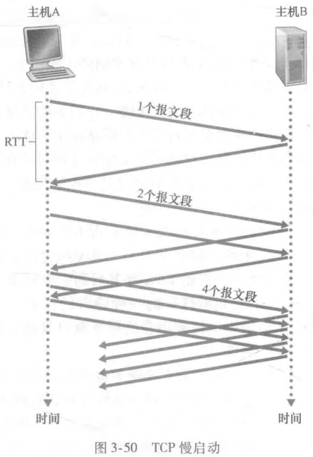

# TCP 拥塞控制

## 流量控制与拥塞控制的区别是什么？

- 流量控制: 调节滑动窗口的大小, 防止发送方发送过多数据导致接收方来不及处理;
- 拥塞控制: 调节滑动窗口中分组的发送速度, 防止网络链路发生拥塞;
- 作用域: 流量控制关心接收方, 拥塞控制关心整个网络;

## 拥塞为什么会导致吞吐量下降？

- 无限缓存场景: 分组传输速率接近链路容量时产生长队列与长时延, 有效速率低于链路容量的一半;
- 有限缓存场景: 缓存溢出造成丢包, 实际吞吐量取决于重传方式, 且低于链路容量的一半;
- 多跳场景: 下游路由器拥塞时, 上游路由器已消耗的传输容量被浪费, 吞吐量进一步下降;

## 拥塞控制有哪些实现思路？

- 端到端拥塞控制: 端系统通过观察网络层的行为自行判断是否拥塞, 无需路由器配合;
- 网络辅助的拥塞控制: 路由器向发送方提供拥塞状态信息;
  - 路由器直接向发送方发送拥塞分组;
  - 路由器在分组中打标记, 经接收方的 ACK 回传给发送方, 至少需要一个 RTT;

## TCP 如何判断网络发生拥塞？

- 依据: 是否发生丢包;
- 信号一: 报文段超时;
- 信号二: 收到 3 个冗余 ACK;

## 拥塞窗口如何约束发送速率？

- 变量: 额外维护一个拥塞窗口 `cwnd`;
- 约束: 在途未确认字节数同时受接收窗口与拥塞窗口限制:

$$LastByteSend - LastByteAcked \le min\{rwnd, cwnd\}$$

## 慢启动如何增长与退出？

- 初值: `cwnd` 初始为 1 个 MSS;
- 增长: 每经过一个 RTT 发送速率翻倍, 即每收到一个报文段就执行 `cwnd += MSS`;
- 退出条件:
  - 超时: 记录 `ssthresh = cwnd / 2`, 把 `cwnd` 重置为 MSS 并重新慢启动;
  - 达到阈值: `cwnd` 达到 `ssthresh` 后进入拥塞避免;
  - 三个冗余 ACK: 执行快速重传并进入快速恢复, 同时记录 `ssthresh = cwnd / 2`;

## 拥塞避免如何增长？

- 增长: 每经过一个 RTT 发送速率只增加一个 MSS, 即每收到一个报文段执行 `cwnd += MSS * (MSS / cwnd)`;
- 退出条件: 与慢启动相同;

## 快速恢复如何处理三个冗余 ACK？

- 进入: `cwnd` 设置为 `ssthresh + 3 * MSS`;
- 增长: 每收到一个 ACK 就令 `cwnd += MSS`;
- 退出: 收到缺失报文段的 ACK 后进入拥塞避免, 并把 `cwnd` 回退为 `ssthresh`;
- 丢包: 出现超时事件时按慢启动处理;

## ECN 提供了什么辅助信号？

- ECN: 明确拥塞通告, 由 IP 数据报首部的 ECN 字段承载;
- 作用: 路由器无需丢弃分组即可把拥塞信息通知给端点;
