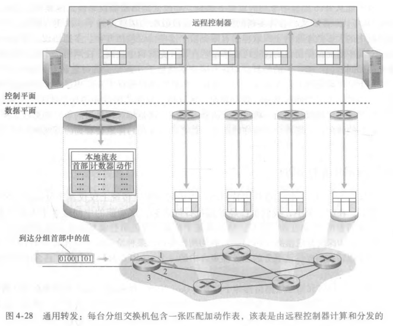

# 通用转发与 OpenFlow

## 通用转发是什么？

- 语义: 匹配 + 动作;
- 匹配: 依据分组首部字段进行模式匹配, 可同时匹配多个协议层的字段;
- 动作: 匹配成功后执行的操作, 如转发、丢弃、修改字段、负载均衡;
- 意义: 一台设备可按软件下发的规则完成原本属于不同层次设备的功能;

## OpenFlow 流表由哪些部分组成？

- 定位: 通用转发的标准实现, 流表即匹配 + 动作转发表;
- 表项组成:
  - 首部字段集合, 用于匹配;
  - 计数器集合, 用于统计;
  - 动作集合, 用于执行;

## OpenFlow 能匹配哪些字段？

- 入端口: 分组交换机接收该分组的输入端口;
- 其余字段: 覆盖链路层、网络层、运输层的首部字段;

## OpenFlow 支持哪些动作？

- 转发: 把分组送到指定的一个或多个端口;
- 丢弃: 直接丢弃分组;
- 修改字段: 改写首部字段后再继续处理;
