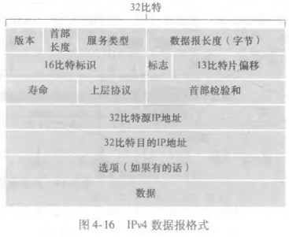

# IPv4 数据报与分片

## IPv4 数据报由哪些部分组成？

- 首部字段: 版本、首部长度、服务类型、总长度、标识、标志、片偏移、TTL、协议、首部检验和、源地址、目的地址等;
- 数据字段: 承载的 TCP 或 UDP 报文段;

## 首部中的 TTL 有什么作用？

- TTL: 数据报允许被转发的最大跳数;
- 递减: 每经过一台路由器减 1;
- 归零: TTL 减到 0 时该数据报被丢弃, 并由路由器回送 ICMP 超时报文;

## 为什么要分片？

- 限制: 每条链路的 MTU (最大链路层帧长度) 不同, 限制了单个 IP 数据报的最大长度;
- 分片: 数据报长度超过链路 MTU 时, 必须拆成多个较小的分片分别传输;

## 分片与组装分别在哪里发生？

- 分片: 可发生在发送方, 也可发生在途中的路由器;
- 组装: 只能在最终接收方进行, 中间路由器不重组;

## 分片依赖哪些首部字段？

- 标识: 同一原始数据报的所有分片共享同一标识值;
- 标志: 指示是否还有后续分片;
- 片偏移: 标明该分片在原始数据报中的位置;
- 组装: 接收方按上述字段把分片还原成原始数据报;
