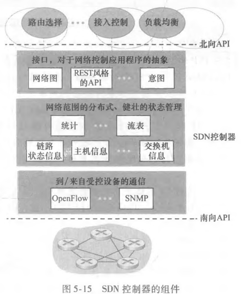

# SDN 控制平面

## SDN 有哪些关键特征？

- 基于流的转发: 转发决策以流为单位, 而非仅按目的地址;
- 分离: 数据平面与控制平面彻底分离;
- 网络控制功能: 由独立的软件承担全网范围的路径计算;
- 可编程: 网络行为可由上层应用编程定义;
- 协议: 控制器与设备之间使用 OpenFlow 协议;

## SDN 控制平面由哪些部分组成？

- SDN 控制器: 维护全网状态并向下发流表;
- SDN 网络控制应用程序: 运行在控制器之上, 通过接口定义具体网络策略;

## SDN 控制器分为哪几层？

- 通信层: 负责 SDN 控制器与受控网络设备之间的通信;
- 网络范围状态管理层: 保存受控网络设备的状态信息;
- 接口层: 向网络控制应用程序提供编程接口;

