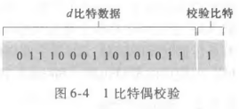
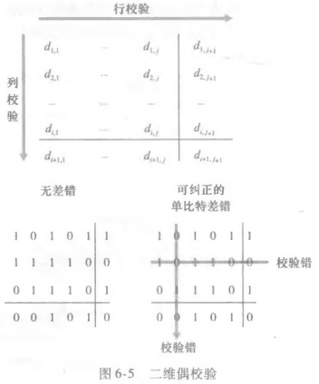

# 奇偶校验与检验和

## 奇偶校验如何工作？

- 做法: 在数据后额外附加 1 个比特;
- 规则: 使 `d + 1` 个比特中 1 的总数为偶数;
- 能力: 只能检测奇数个比特出错, 无法定位错误位置;

## 二维奇偶校验如何定位差错？

- 编排: 把 `d` 个比特划分为 `i` 行 `j` 列;
- 校验位: 使用 `i + j + 1` 个奇偶比特;
- 能力: 不仅能检测差错, 还能定位到具体行列并纠正单个比特错误;

## 前向纠错与重传有何区别？

- FEC (前向纠错): 接收方自行检测并纠正差错, 不请求重传;
- 适用: 时延敏感或无法反向通信的场景, 如卫星链路;
- 代价: 需要更多冗余比特;

## 检验和方法如何计算？

- 发送方: 把帧中所有 16 bit 数据求和, 取和的反码作为检验和;
- 接收方: 把所有数据与检验和一起求和;
- 判定: 结果所有比特均为 1 说明无差错;
- 关系: 与 UDP 检验和的思想相同, 见 [UDP 与检验和](../../030-运输层/010-运输层基础/030-UDP与检验和.md);
