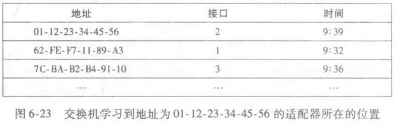
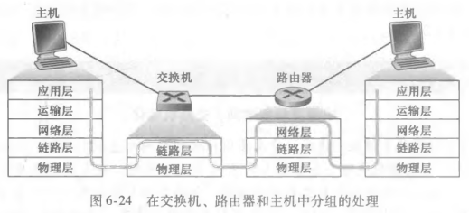

# 链路层交换机

## 链路层交换机是什么设备？

- 属性: 即插即用设备, 无需人工配置;
- 依据: 通过 MAC 地址而不是 IP 地址转发帧;
- 位置: 通常用于连接同一局域网内的主机与网段;

## 交换机如何转发和过滤帧？

- 过滤: 决定一帧是转发还是丢弃;
- 转发: 决定该帧应从哪个接口发出;
- 依据: 交换机表, 表项为 (MAC 地址, 接口, 时间);
- 三种情形:
  - 表中无该目标地址: 向除入接口外的所有接口广播;
  - 表中接口等于入接口: 丢弃该帧;
  - 表中接口不等于入接口: 从该接口转发;

## 自学习如何建立交换机表？

- 特点: 表通过自动、动态、自治的方式建立;
- 初始: 交换机表为空;
- 学习: 每收到一个入帧, 记录该帧的源 MAC 地址、到达的接口与当前时间;
- 老化: 一段时间内未再收到以某地址为源地址的帧, 就删除该表项;

## 链路层交换机有哪些性质？

- 消除碰撞: 每个接口独占带宽, 不再与其他接口竞争;
- 异构互联: 可连接不同种类的链路;
- 管理功能: 支持流量监控与端口管理;

## 交换机与路由器有何区别？

- 转发依据: 路由器按 IP 地址转发, 链路层交换机按 MAC 地址转发;
- 共同点: 两者都是存储转发分组交换机;

## 交换机毒化如何攻击？

- 手段: 向交换机发送大量带有伪造源 MAC 地址的帧, 填满交换机表;
- 后果: 交换机表项被挤占, 交换机被迫广播大多数帧;
- 危害: 攻击者可嗅探到这些广播帧;
