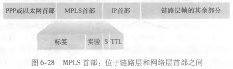

# VLAN 与 MPLS

## VLAN 解决什么问题？

- 需求: 一个物理局域网内需要按逻辑划分出相互隔离的多个局域网;
- 做法: 支持 VLAN 的交换机把多个端口划分为多个组;
- 映射: 一个组对应一个虚拟局域网, 组内通信等价于同一局域网, 组间流量隔离;

## MPLS 如何加快转发？

- MPLS: 多协议标签交换, 使用 MPLS 首部承载标签;
- 机制: 路由器按标签而不是按完整的 IP 首部做转发决策;
- 收益: 查表更简单, 可配合流量工程规划显式路径;

