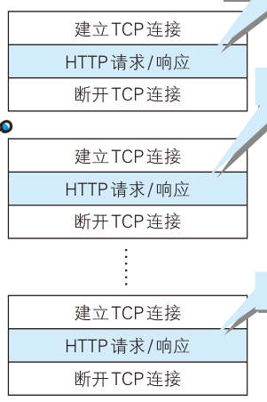
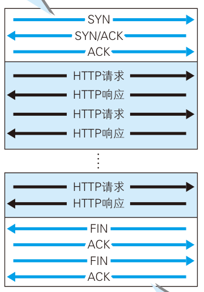

# HTTP 连接管理

## 非持久连接与持久连接有什么区别？

- 非持久连接: 一次 HTTP 请求建立并断开一次 TCP 连接, 产生无用的通信开销; HTTP/1.0 默认;
- 持久连接 (HTTP keep-alive): 任意一端未断开就保持 TCP 连接状态, 减少重复建立与断开的开销; HTTP/1.1 默认;
- 控制: 非持久连接可用 `Connection: Keep-Alive` 尝试复用, 持久连接用 `Connection: close` 关闭;
- 前提: 要求 HTTP 请求为同源请求;

## 管线化解决了什么, 又留下了什么问题？

- 管线化: HTTP/1.1 特性, 一次发送多个请求, 不必逐个等待响应;
- 限制: 响应仍必须按请求发送顺序返回;
- 结果: 队首阻塞依旧存在;

## 多路复用如何消除队首阻塞？

- 归属: HTTP/2 特性;
- 机制: 请求与响应被拆成帧, 在一条连接上并行交错传输;
- 效果: 请求与响应之间互不影响, 不需要按发送顺序返回;
- 详见 [HTTP 版本演进](../020-HTTP演进/010-HTTP版本演进.md);
