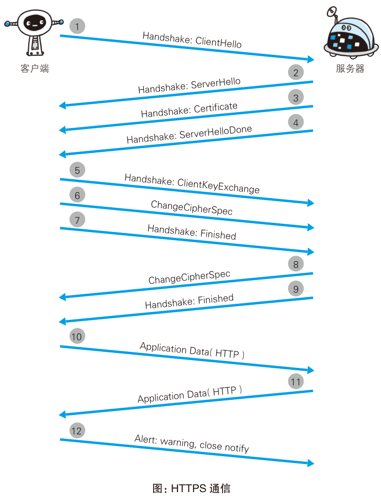
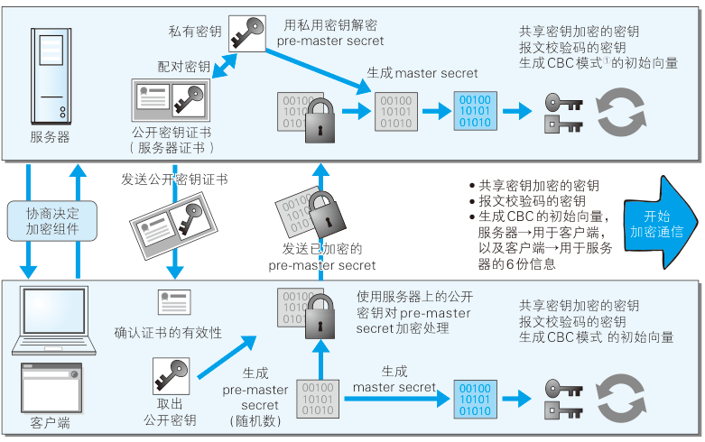

# TLS 握手与连接恢复

## TLS 握手分哪几个阶段？

- 第一次握手:
  - 客户端发 `Client Hello`: 随机数 1、支持的加密算法、支持的协议版本;
  - 服务端发 `Server Hello`: 随机数 2、选定的加密算法与协议版本;
  - 服务端发 `Certificate`: 公钥证书;
  - 服务端发 `Server Hello Done`, 第一次握手结束;
- 第二次握手:
  - 客户端发 `Client Key Exchange`: 随机数 3, 由随机数 1、2、3 构造 pre-master secret, 用公钥加密后发送;
  - 客户端发 `Change Cipher Spec`, 声明之后按 pre-master secret 校验;
  - 客户端发 `Finished`;
  - 服务端发 `Change Cipher Spec`;
  - 服务端发 `Finished`;
- 第三次握手: 客户端发 HTTP 请求, 服务端返回响应;
- 第四次握手: 客户端发 `close_notify` 断开 SSL, 之后发 TCP FIN;

## 为什么需要三个随机数？

- 增加解密难度;
- 确保每个会话使用不同的对称密钥;

## SSL 连接断开后如何恢复？

- 前提: SSL 建立在 TCP 之上, SSL 断开时 TCP 仍可保持连接;
- 恢复方式: 重新握手, 复用前两次握手的结果, 去掉 `Change Cipher Spec` 报文;
- 收尾: 客户端在 `Finished` 之后, 用已有 pre-master secret 再发送一个 `Finished`;

## SSL 与 TLS 是什么关系？

- TLS 以 SSL 为原型开发, 是 SSL 的标准化后续版本;
- 日常所说的 SSL 证书实际工作在 TLS 之上;
