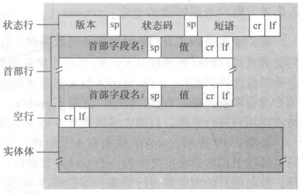

# HTTP 报文格式

## HTTP 请求报文由哪几部分组成？

- 请求行: 方法字段 + URL + HTTP 版本;
- 首部行: 描述请求的元信息, 如 `Content-Type`、`Content-Length`、`User-Agent`;
- 空行: 分隔首部与实体体;
- 实体体: 仅 POST 等方法使用, GET 请求通常没有;

```http
POST /mcp/pc/pcsearch HTTP/1.1
Accept-Encoding: gzip, deflate, br
Content-Length: 56
Content-Type: application/json
User-Agent: Mozilla/5.0 (Windows NT 10.0; Win64; x64)
```


## HTTP 响应报文由哪几部分组成？

- 状态行: HTTP 版本 + 状态码 + 状态短语;
- 首部行: 描述响应的元信息, 如 `Content-Type`、`Content-Length`、`Date`;
- 空行: 分隔首部与实体体;
- 实体体: 返回的资源内容;

```http
HTTP/1.1 200 OK
Access-Control-Allow-Origin: https://www.baidu.com
Content-Length: 121
Content-Type: application/json; charset=utf-8
Date: Tue, 29 Aug 2023 11:46:39 GMT
```



## 为什么两类报文都依赖空行分隔？

- 首部行数量不固定, 需要空行作为结束标志;
- 解析器遇到空行后, 其余字节全部归入实体体, 从而支持二进制内容;
