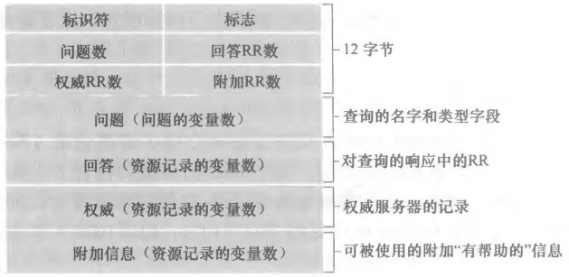

# DNS 资源记录与报文

## 资源记录由哪些字段构成？

- 资源记录 (RR): 四元组 `(Name, Value, Type, TTL)`;
- Name 与 Value: 含义取决于 Type;
- TTL: 该记录的缓存存活时间;

## 常见资源记录类型分别表示什么？

| Type  | Name           | Value                                   |
| ----- | -------------- | --------------------------------------- |
| A     | 主机名         | 主机的 IP 地址                          |
| NS    | 域             | 知道该域 IP 地址的权威 DNS 服务器主机名 |
| CNAME | 主机别名       | 规范主机名                              |
| MX    | 邮件服务器别名 | 邮件服务器的规范主机名                  |

## DNS 报文由哪些区域组成？

- 首部区域: 报文的元数据;
- 问题区域: 本次查询的信息;
- 回答区域: 查询的回复记录;
- 权威区域: 其他权威服务器的记录;
- 附加区域: 其他有帮助的信息;
- 格式一致性: 查询报文与回复报文使用完全相同的格式;

