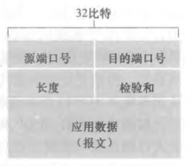

# UDP 与检验和

## UDP 适用于哪些场景？

- 精细控制数据: 应用自行决定发送时机与重传策略;
- 无需连接建立: 省去握手往返时延;
- 无状态连接: 服务器不必维护连接状态;
- 首部开销小: 仅有 4 个字段;

## UDP 报文段的结构是什么？

- 规范: RFC 768 定义;
- 首部字段: 源端口号 + 目标端口号 + 报文段长度 + 检验和, 每个字段 2 字节;
- 数据字段: 应用层报文;
- 特征: 首部只有 8 字节, 且不携带序号与确认号;

## 检验和如何计算与校验？

- 发送方: 把报文段中所有 16 bit 字相加, 结果取反码作为检验和;
- 溢出处理: 相加产生 17 bit 时, 把最高位回卷到低 16 bit 继续相加 (回卷进位);
- 接收方: 把所有 16 bit 字与检验和相加;
- 判定: 结果所有比特均为 1 说明无差错;

## 检验和能做什么、不能做什么？

- 能做: 检测报文段在传输中出现的比特差错;
- 不能做: UDP 只能检查错误, 无法修复错误, 也不会重传;
