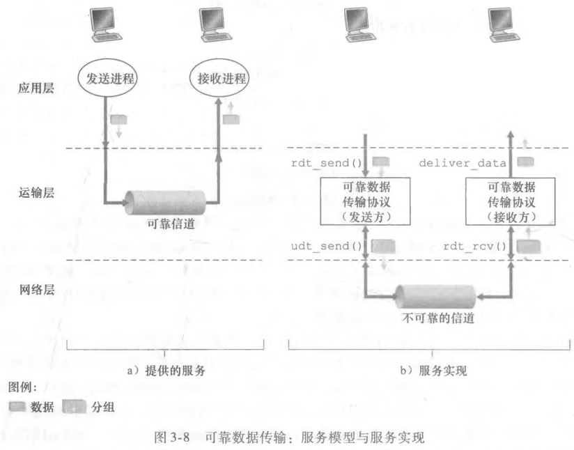
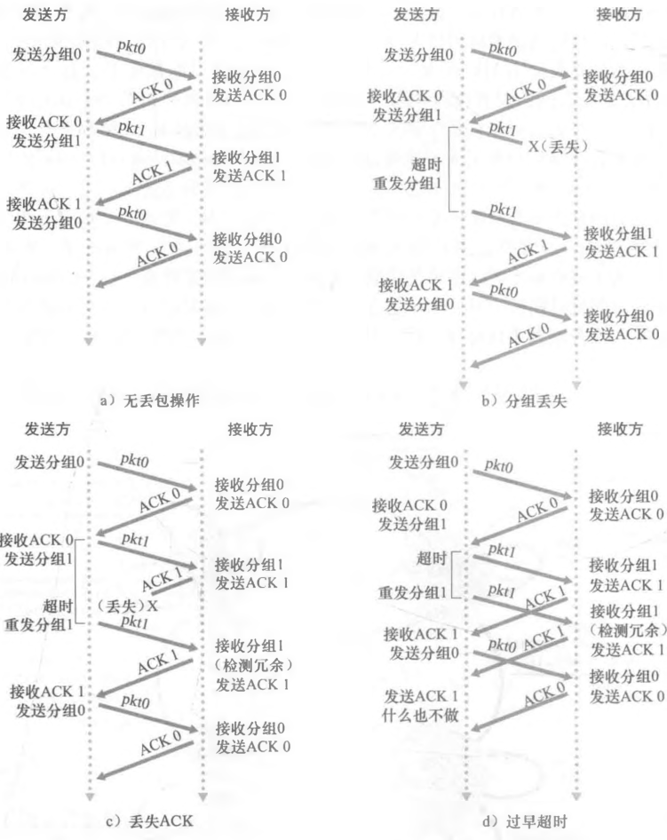

# 可靠传输原理与 ARQ

## 可靠数据传输协议面对哪些信道假设？

- 目标: 保证运输层数据不损坏、不丢失;
- 前提: 运输层下层的协议不一定可靠;
- 传输模式: 单向为单工, 双向为全双工;

## 完全可靠信道上需要做什么？

- 发送端把分组送入信道, 接收端从信道取出分组;
- 信道不丢不损, 双方无需任何额外控制操作;

## 出现比特差错时如何用 ARQ 恢复？

- ARQ (自动重传请求): 接收方用控制报文告知哪些数据正确接收、哪些需要重传;
- 三项机制:
  - 差错检测: 检验收到的分组是否正确;
  - 接收方反馈: 回送 ACK 或 NAK 控制报文;
  - 重传: 接收方收到错误分组后, 发送方重传该分组;

## 停等协议如何工作？

- 停等: 发送方发送一个分组后, 在收到接收方的控制报文之前不发送新分组;
- 代价: 链路往返时延内链路空闲, 吞吐量受限;
- 优化方向见 [流水线与回退 N 步](./020-流水线与回退N步.md);

## ACK/NAK 受损时如何解决？

- 问题: 接收方回送的 ACK/NAK 本身也可能损坏;
- 解决: 发送方给数据分组编号, 接收方通过序号判断收到的是新分组还是重传分组;
- 效果: 重复分组不会造成重复交付;

## 如何用只发 ACK 的机制替代 NAK？

- 接收方收到错误分组时, 返回上一个正确接收分组的 ACK;
- 发送方连续收到同一序号的 ACK, 即判定接收方收到了错误分组;
- 发送方收到受损的分组时, 同样按出错处理;

## 比特交替协议如何处理丢包？

- 序号: 只用 1 bit 标识序号, 在 0 与 1 之间来回交替;
- 反馈: 只使用 ACK, 通过 ACK 的序号判断接收方是否出错;
- 丢包来源: 发送方发出的数据分组丢失, 或接收方回送的控制报文丢失;
- 检测手段: 用定时器计时, 超过一定时间未收到确认即判定丢包, 重传该分组;

