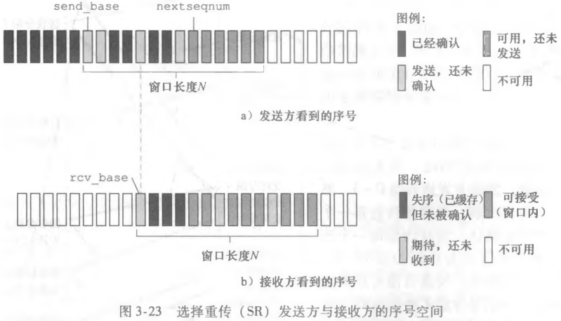

# 选择重传 SR

## 选择重传的发送方如何工作？

- 窗口: 在流水线上确定长度为 N 的发送窗口;
- 发送: 依次发送窗口内所有分组直至发完, 然后等待 ACK;
- 定时器: 每个分组各有一个定时器;
- 超时: 只重传超时的那个分组, 而不是整个窗口;

## 选择重传的接收方如何工作？

- 接收窗口: 同样维护长度为 N 的窗口, 并随最左侧分组被确认而向右滑动;
- 缓存: 窗口内非最左侧的分组正确接收后先缓存, 等缺失分组补齐再一并交付;
- 效果: 避免重传已经正确到达的分组;

## GBN 与 SR 的差异是什么？

| 维度         | 回退 N 步 (GBN)      | 选择重传 (SR)    |
| ------------ | -------------------- | ---------------- |
| 发送方定时器 | 只给最左侧未确认分组 | 每个分组各一个   |
| 发送方重传   | 重传整个窗口         | 只重传超时的分组 |
| 接收方缓存   | 不缓存失序分组       | 缓存失序分组     |
| 带宽利用     | 单个丢失代价大       | 单个丢失代价小   |
| 接收方复杂度 | 低                   | 高               |
